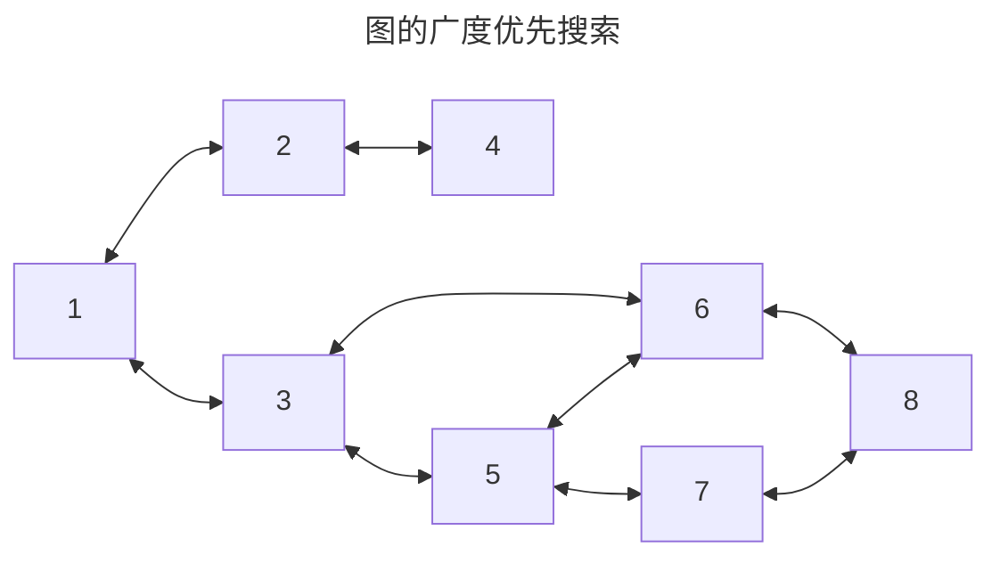
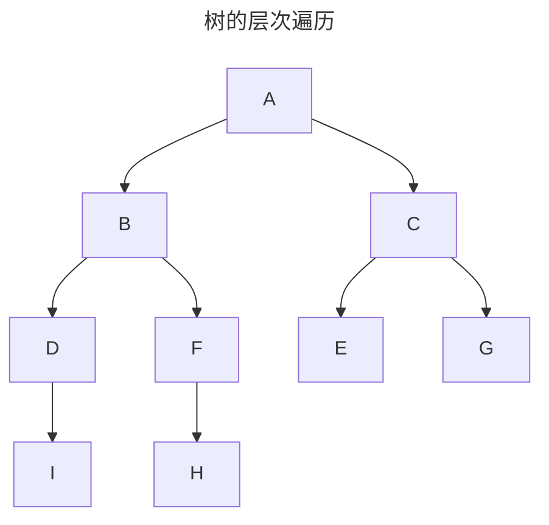
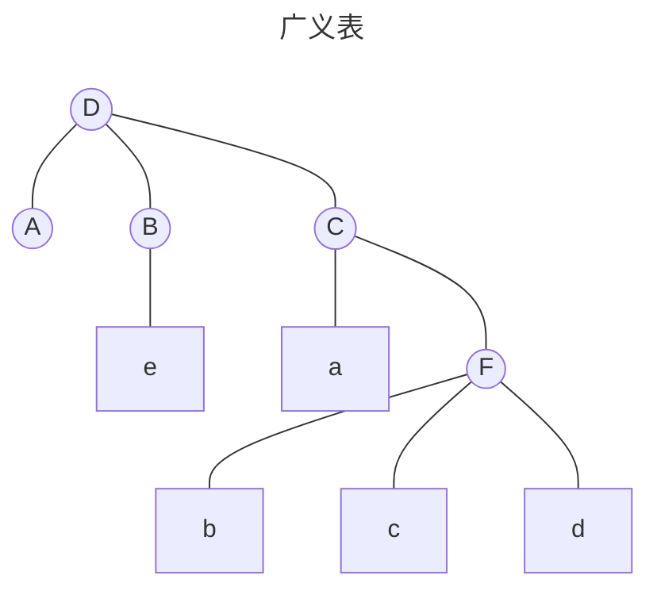

# 栈、队列、数组

## 1. 栈

- 只允许在一端进行插入和删除操作的线性表

- $n$ 个不同元素进栈,出栈元素的不同排列的个数为 $\displaystyle{\frac{1}{n+1}\binom{n}{2n}}$(卡特兰数)

- 具体实现有顺序栈、链栈 (带头节点和不带头节点) 和 共享栈

``` c
  InitStack(Stack *S)//初始化栈
  EmptyStack(Stack *S)//判断栈是否为空
  Push(Stack *S,int x)//进栈
  Pop(Stack *S,int* x)//弹栈
  GetTop(Stack *S,int* x)//读取栈顶元素
  PrintStack(Stack S)//打印栈中元素
  Length(Stack S)//栈中元素个数
```


## 2. 队列

- 只允许在一端进行插入操作, 在另一端进行删除操作的线性表

- 具体实现有顺序队列、链队列 (带头节点和不带头节点)

- 双端队列: 两端都能插入和删除的队列

- 输出受限的双端队列: 允许在一端进行插入删除,另一端只允许插入
- 输入受限的双端队列: 允许在一端进行插入删除,另一端只允许输出

``` c
InitQueue(SqQueue *Q); // 初始化队列
DestroyQueue(SqQueue *Q); // 销毁队列
EmptyQueue(SqQueue *Q); // 判空
EnQueue(SqQueue *Q, int e); //入队
DeQueue(SqQueue *Q, int* e); //出队
GetHead(SqQueue *Q, int* e); //获取队头元素
LengthQueue(SqQueue Q); //队列长队
PrintQueue(SqQueue Q); // 打印队列
```
## 3. 栈和队列的应用

### 3.1 括号匹配

### 3.2 表达式求值
- 表达式由操作数、运算符、界限符组成, 这三者的不同位置组成了不同的表达式形式

1. 逆波兰表达式 (后缀表达式): $a\ b\ c\ +\ -$
> 运算符在最后, 操作数在运算符前面, 先写左操作数, 后写右操作数

2. 波兰表达式 (前缀表达式): $-\ a\ +\ b\ c$
> 运算符在最前, 操作数在运算符后面, 先写左操作数, 后写右操作数

3. 中缀表达式: $a\ -\ (b\ +\ c)$


### 3.3 表达式之间的转换

$$
A+B*(C-D)-E/F
$$

后缀表达式
$$
\begin{cases}
A\ B\ C\ D\ - \ *\ +\ E\ F\ /\ -\\
A\ B\ C\ D\ - \ *E\ F\ /\ -\ +
\end{cases}
$$

前缀表达式
$$
-\ +\ A\ *\ B\ -\ C\ D\ /\ E\ F
$$


### 3.4 递归和非递归实现
- 汉诺塔问题、斐波那契数列问题、树的遍历
#### 分治法
- 1. 能够将一个问题转化为一个新问题, 新问题和原问题解法相同, 只是问题规模减小
- 2. 必须有一个明确的递归出口, 或称为递归边界 

### 3.5 队列的应用

#### 图的广度优先搜索


$$
1\to 2\to 3\to 4\to 5\to 6\to 7\to 8
$$

#### 树的层次遍历

$$
A\to B\to C\to D\to F\to E\to G\to I\to H
$$

## 3. 数组

### 3.1 数组的定义
- 数组是由类型相同的元素构成的有序集合, 每个元素称为数组元素, 每个元素有唯一下标, 可通过下标访问该数据元素
- 一维数组可以看作线性表; 二维数组是数据元素为一维数组的线性表

### 3.2 数组的存储

- 数组的存储:行优先和列优先

| $b[0][0]$ | $b[0][1]$ | $b[0][2]$ |
| --------- | --------- | --------- |
| $b[1][0]$ | $b[1][1]$ | $b[1][2]$ |

- **行优先存储**:

| $b[0][0]$ | $b[0][1]$ | $b[0][2]$ | $b[1][0]$ | $b[1][1]$ | $b[1][2]$ |
| --------- | --------- | --------- | --------- | --------- | --------- |

- **列优先存储**:

| $b[0][0]$ | $b[1][0]$ | $b[0][1]$ | $b[1][1]$ | $b[0][2]$ | $b[1][2]$ |
| --------- | --------- | --------- | --------- | --------- | --------- |

- 在 `Basic` 、`Pascal`、`Java`、`C` 中都是以行序优先的存储方式, `FORTRAN` 是以列序优先的存储方式

$$LOC(i,j) = LOC(0,0) + (n\times i + j)L$$

### 3.3 特殊矩阵的压缩存储
#### 3.3.1 对称矩阵

- $a_{ij}$ 在数组中的下标 $k$
$$ k =
\begin{cases}
\dfrac{i(i-1)}{2}+j-1, & i\geq j\\
\dfrac{j(j-1)}{2}+i-1, & i<j\ (a_{ij}=a_{ji})
\end{cases}
$$


#### 3.3.2 三角矩阵

- 与对称矩阵一致,需要一个元素的空间来存储常量

(1). 下三角矩阵

$a_{ij}$在数组中的下标$k$:
$$
k=\left\{ \begin{matrix}
\dfrac{i(i-1)}{2}+j-1,\ i\geq j\\
\dfrac{n(n+1)}{2},\ i<j\ (a_{ij}=c)
\end{matrix}
\right.
$$

(2). 上三角矩阵

$a_{ij}$在数组中的下标$k$:
$$
k=\left\{ \begin{matrix}
\dfrac{(i-1)(2n-i+2)}{2}+j-i,\ i\leq j\\
\dfrac{n(n+1)}{2},\ i>j\ (a_{ij}=c)
\end{matrix}
\right.
$$


#### 3.3.3 对角矩阵

$a_{ij}$在数组中的下标$k$:
$$
k=\left\{ \begin{matrix}
2i+j-3,\ |i-j|\leq 1\\
0,\ |i-j|>1
\end{matrix}
\right.
\\
\left\{ \begin{matrix}
i=[\dfrac{k+1}{3}+1]\\
j=k-2i+3
\end{matrix}
\right.
$$


#### 3.3.4 稀疏矩阵

- 采用三元组的方式存储

| $i$ | $j$ | $num$ |
|-----|-----|-------|
| $0$ | $0$ | $4$   |
| $1$ | $2$ | $6$   |
| $2$ | $1$ | $9$   |
| $3$ | $1$ | $23$  |

## 4. 广义表



## 数据结构可视化网址
[数组栈](https://www.cs.usfca.edu/~galles/visualization/StackArray.html)
[链表栈](https://www.cs.usfca.edu/~galles/visualization/StackLL.html)
[数组队列](https://www.cs.usfca.edu/~galles/visualization/QueueArray.html)
[链表队列](https://www.cs.usfca.edu/~galles/visualization/QueueLL.html)
