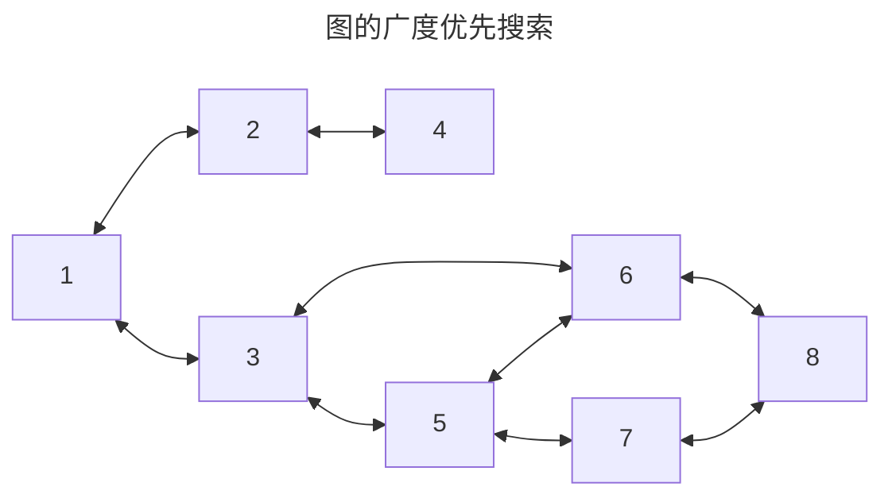
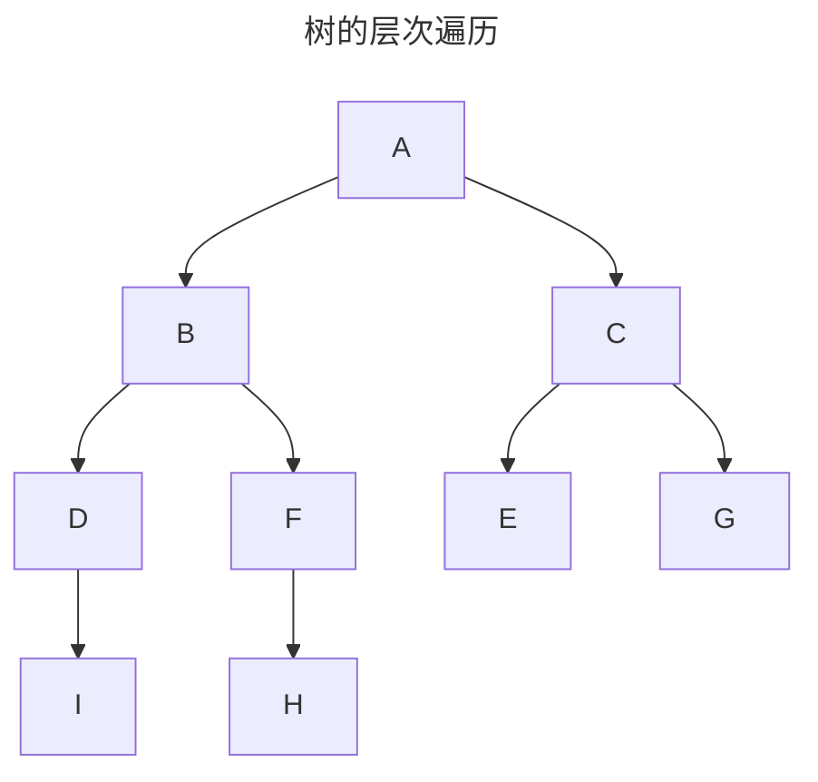

# 栈、队列、数组

## 1.  栈

- ==只允许在一端进行插入和删除操作的线性表==

- $n$ 个不同元素进栈,出栈元素的不同排列的个数为 $\frac{1}{n+1}C_{n}^{2n}$（卡特兰数）

```c
  InitStack(Stack &S)//初始化栈
  IsEmpty(S)//判断栈是否为空
  Push(&S,x)//进栈
  Pop(&S,&x)//弹栈
  GetTop(S,&x)//读取栈顶元素
  PrintStack(S)//打印栈中元素
  Length(S)//栈中元素个数
```


- **顺序存储**实现==Stack==

```c
#include <stdio.h>
#include <stdlib.h>
#include <stdbool.h>
#define MaxSize 50
typedef struct{
    int data[MaxSize];
    int top;
}SqStack;

//函数声明
void InitStack(SqStack *S);//初始化
bool IsEmpty(SqStack S);//判断栈是否为空
bool Push(SqStack *S, int x);//进栈
bool Pop(SqStack *S, int *x);//出栈
bool GetTop(SqStack S, int *x);//取栈顶元素
int Length(SqStack S);//栈中元素个数
void PrintStack(SqStack S);//打印栈中元素

//初始化
void InitStack(SqStack *S){
    S->top = -1;
}
//判断栈是否为空
bool IsEmpty(SqStack S){
    if(S.top == -1)
        return true;
    else
        return false;
}
//进栈
bool Push(SqStack *S, int x){
    if(S->top == MaxSize - 1)
        return false;
    S->top++;
    S->data[S->top] = x;
    return true;
}
//出栈
bool Pop(SqStack *S, int *x){
    if(S->top == -1)
        return false;
    *x = S->data[S->top];
    S->top--;
    return true;
}
//取栈顶元素
bool GetTop(SqStack S, int *x){
    if(S.top == -1)
        return false;
    *x = S.data[S.top];
    return true;
}

//栈中元素个数
int Length(SqStack S)
{
    return S.top+1;
}

//打印栈中元素,从栈顶到栈堆
void PrintStack(SqStack S)
{
    int x=S.top;
    while(x>=0)
    {
        printf("%d  ",S.data[x]);
        x--;
    }
    printf("\n");
}
```

- **链式存储**实现栈
- ==本质上是单链表的头插入==
 ```c
  //不带头节点实现
  #include <stdio.h>
  #include <stdlib.h>
  #include <stdbool.h>
  typedef struct Node{
      int data;
      struct Node *next;
  }Node,*Stack;
  
  //函数声明
  void InitStack(Stack* S);//初始化
  bool IsEmpty(Stack S);//判断栈是否为空
  bool Push(Stack *S, int x);//进栈
  bool Pop(Stack *S, int *x);//出栈
  bool GetTop(Stack S, int *x);//取栈顶元素
  int Length(Stack S);//栈中元素个数
  void PrintStack(Stack S);//打印栈中元素
  
  //初始化
  void InitStack(Stack* S){
      *S=NULL;
  }
  
  //判断栈是否为空
  bool IsEmpty(Stack S){
      return (S== NULL);
  }
  
  //进栈
  bool Push(Stack *S, int x){
      Node *L=(Node*)malloc(sizeof(Node));
      if (L==NULL)
          return false;
      L->data=x;
      L->next=*S;
      *S=L;
      return true;
  }
  
  //出栈
  bool Pop(Stack *S, int *x){
      if (*S==NULL)
          return false;
      *x=(*S)->data;
      *S=(*S)->next;
      return true;
  }
  
  //取栈顶元素
  bool GetTop(Stack S, int *x){
      if(S== NULL)
          return false;
      *x =S->data;
      return true;
  }
  
  //栈中元素个数
  int Length(Stack S)
  {
      int len=0;
      Node * p=S;
      while (p!=NULL)
      {
          len++;
          p=p->next;
      }
      return len;
  }
  
  //打印栈中元素
  void PrintStack(Stack S)
  {
      Node* p=S;
      while(p!=NULL)
      {
          printf("%d  ",p->data);
          p=p->next;
      }
      printf("\n");
  }
 ```
```c
  //带头节点实现
  #include <stdio.h>
  #include <stdlib.h>
  #include <stdbool.h>
  typedef struct Node{
      int data;
      struct Node *next;
  }Node,*Stack;
  
  //函数声明
  bool InitStack(Stack* S);//初始化
  bool IsEmpty(Stack S);//判断栈是否为空
  bool Push(Stack *S, int x);//进栈
  bool Pop(Stack *S, int *x);//出栈
  bool GetTop(Stack S, int *x);//取栈顶元素
  int Length(Stack S);//栈中元素个数
  void PrintStack(Stack S);//打印栈中元素
  
  //初始化
  bool InitStack(Stack* S){
      *S=(Node*)malloc(sizeof(Node));
      if (*S==NULL)
          return false;
      (*S)->next=NULL;
      return true;
  }
  
  //判断栈是否为空
  bool IsEmpty(Stack S){
      return (S->next==NULL);
  }
  
  //进栈
  bool Push(Stack *S, int x){
      Node *L=(Node*)malloc(sizeof(Node));
      L->data=x;
      L->next=*S;
      *S=L;
      return true;
  
  }
  
  //出栈
  bool Pop(Stack *S, int *x){
      if ((*S)->next==NULL)
          return false;
      *x=(*S)->next->data;
      (*S)->next=(*S)->next->next;
      return true;
  }
  
  //取栈顶元素
  bool GetTop(Stack S, int *x){
      if(S->next== NULL)
          return false;
      *x =S->next->data;
      return true;
  }
  
  //栈中元素个数
  int Length(Stack S)
  {
      int len=0;
      Node * p=S->next;
      while (p!=NULL)
      {
          len++;
          p=p->next;
      }
      return len;
  }
  
  //打印栈中元素
  void PrintStack(Stack S)
  {
      Node* p=S->next;
      while(p!=NULL)
      {
          printf("%d  ",p->data);
          p=p->next;
      }
      printf("\n");
  }
  
```

- **共享栈**

```c
  #include <stdio.h>
  #include <stdlib.h>
  #include <stdbool.h>
  #define MaxSize 50
  typedef struct 
  {
      int data[MaxSize];
      int top[2];
  }ShareStack;
  
  //函数声明
  void InitStack(ShareStack* S);//初始化
  bool IsEmpty(ShareStack S);//判断共享栈是否为空
  bool Push(ShareStack *S,int i,int x);//入栈
  bool Pop(ShareStack *S,int i,int *x);//出栈
  bool GetTop(ShareStack S,int i,int *x);//取栈顶元素
  int Length(ShareStack S,int i);//栈中元素个数
  void PrintStack(ShareStack S,int i);//打印栈中元素
  
  //初始化
  void InitStack(ShareStack *S){
      S->top[0]=-1;
      S->top[1]=MaxSize;
  }
  
  //判断栈是否为空
  bool IsEmpty(ShareStack S){
      if(S.top[0]== -1 && S.top[1]==MaxSize)
          return true;
      else
          return false;
  }
  
  //进栈
  bool Push(ShareStack *S, int i,int x){
      if (S->top[1]-S->top[0]==1)
          return false;
      if(i==0)
      {
          S->top[0]++;
          S->data[S->top[0]]=x;
          return true;
      }
      if(i==1)
      {
          S->top[1]--;
          S->data[S->top[1]]=x;
          return true;
      }
  }
  
  //出栈
  bool Pop(ShareStack *S, int i, int *x){
      if (i==0)
      {
          if (S->top[0]==-1)
              return false;
          *x=S->data[S->top[0]];
          S->top[0]--;
          return true;
      }
      if(i==1)
      {
          if (S->top[1]==MaxSize)
              return false;
          *x=S->data[S->top[1]];
          S->top[1]++;
          return true;
      }
  }
  
  //取栈顶元素
  bool GetTop(ShareStack S, int i, int *x){
      if (i==0)
      {
          if (S.top[0]==-1)
              return false;
          *x=S.data[S.top[0]];
          return true;
      }
      if(i==1)
      {
          if (S.top[1]==MaxSize)
              return false;
          *x=S.data[S.top[1]];
          return true;
      }
  }
  
  //栈中元素个数
  int Length(ShareStack S,int i)
  {
      int len=0;
      if (i==0)
          return S.top[0]+1;
      if (i==1)
          return MaxSize-S.top[1];
  }
  
  //打印栈中元素
  void PrintStack(ShareStack S,int i)
  {
      if (i==0)
      {
          int x=S.top[0];
          while (x>=0)
          {
              printf("%d  ",S.data[x]);
              x--;
          }
          printf("\n");
      }
      if(i==1)
      {
          int y=S.top[1];
          while (y<MaxSize)
          {
              printf("%d  ",S.data[y]);
              y++;
          }
          printf("\n");
      }
  }
```

  

## 2. 队列

### 2.1 队列

```c
InitQueue()//初始化队列
IsEmpty(Q)//判断队列是否为空
EnQueue(&Q,x)//入队操作
DeQueue(&Q,&x)//出队操作,非空将队头元素删除,返回x
PrintQueue(Q)//打印栈中元素
Length(Q)//栈中元素个数
```

- ==顺序实现和链表实现==
- ==顺序队列会出现假溢出现象==

```c
//顺序实现循环队列
#include <stdio.h>
#include <stdlib.h>
#include <stdbool.h>
#define MaxSize 50
typedef struct SqQueue{
    int data[MaxSize];
    int front;
    int rear;
    int size;
}SqQueue;

//函数声明
void InitQueue(SqQueue *Q);//初始化
bool IsEmpty(SqQueue Q);//判断队列是否为空
bool EnQueue(SqQueue *Q, int x);//入队
bool DeQueue(SqQueue *Q, int *x);//出队
int Length(SqQueue Q);//队列中元素个数
void PrintQueue(SqQueue Q);//打印队列中元素

//初始化
void InitQueue(SqQueue *Q)
{
    Q->front=Q->rear=0;
    Q->size=0;
}

//判断队列是否为空
bool IsEmpty(SqQueue Q)
{
    return (Q.size==0);
}

//入队
bool EnQueue(SqQueue *Q, int x)
{
    if (Q->size==MaxSize)
        return false;
    Q->data[Q->rear]=x;
    Q->rear=(Q->rear+1)%MaxSize;
    Q->size++;
    return true;
}

//出队
bool DeQueue(SqQueue *Q,int *x)
{
    if (Q->size==0)
        return false;
    *x=Q->front;
    Q->front=(Q->front+1)%MaxSize;
    Q->size--;
    return true;
}

//队列中元素个数
int Length(SqQueue Q)
{
    return Q.size;
}

//打印队列中元素
void PrintQueue(SqQueue Q)
{
    int x=0;
    while (x<Q.size)
    {
        printf("%d  ",Q.data[(Q.front+x)%MaxSize]);
        x++;
    }
    printf("\n");
}
```

```c
//链表实现
#include <stdio.h>
#include <stdlib.h>
#include <stdbool.h>
#define MaxSize 50
typedef struct Node{
    int data;
    struct Node* next;

}Node;
typedef struct Queue{
    struct Node * front;
    struct Node * rear;
}Queue;

//函数声明
void InitQueue(Queue *Q);//初始化
bool IsEmpty(Queue Q);//判断队列是否为空
bool EnQueue(Queue *Q, int x);//入队
bool DeQueue(Queue *Q, int *x);//出队
int Length(Queue Q);//队列中元素个数
void PrintQueue(Queue Q);//打印队列中元素

//初始化
void InitQueue(Queue *Q)
{
   Q->front=(Node*)malloc(sizeof(Node));
   Q->rear=Q->front;
   Q->front->next=NULL;
}

//判断队列是否为空
bool IsEmpty(Queue Q)
{
    return (Q.front==Q.rear);
}

//入队
bool EnQueue(Queue *Q, int x)
{
    Node * p=(Node*)malloc(sizeof(Node));
    if (p==NULL)
        return false;
    p->data=x;
    Q->rear->next=p;
    p->next=NULL;
    Q->rear=p;
    return true;
}

//出队
bool DeQueue(Queue *Q,int *x)
{
    if (Q->front==Q->rear)
        return false;
    Node* p=Q->front->next;
    *x=p->data;
    Q->front->next=p->next;
    if (p==Q->rear)
        Q->rear=Q->front;
    free(p);
    return true;
}

//队列中元素个数
int Length(Queue Q)
{
    Node* p=Q.front;
    int len=0;
    while (p!=Q.rear)
    {
        p=p->next;
        len++;
    }
    return len;
}

//打印队列中元素
void PrintQueue(Queue Q)
{
    Node* p=Q.front;
    while (p!=Q.rear)
    {
        p=p->next;
        printf("%d  ",p->data);
    }
    printf("\n");
}
int main()
{
    Queue Q;
    InitQueue(&Q);
    for (int i=1;i<10;i++)
    {
        EnQueue(&Q,i);
    }
    PrintQueue(Q);
    printf("%d\n",Length(Q));
    return 0;
}
```

### 2.2 双端队列

- ==两端都能插入和删除的队列==
- ==输出受限==的双端队列:允许在一端进行插入删除,另一端只允许插入
- ==输入受限==的双端队列:允许在一端进行插入删除,另一端只允许输出

## 3. 表达式求值

表达式由==操作数、运算符、界限符==组成,这三者的不同位置组成了不同的表达式形式

### 3.1 前缀表达式、中缀表达式、后缀表达式 

- 逆波兰表达式（后缀表达式 ） $a\ \ b\  +$

- 波兰表达式（前缀表达式）$+\ \ a\ \ b$

- 中缀表达式 $a\ \ +\ \ b$

- $((15$ &divide; $(7-(1+1)))\times 3)-(2+(1+1))$

-  中缀$\Rightarrow$后缀:==左操作数写左边,右操作数写右边,最后写运算符==；中缀$\Rightarrow$前缀:==在最前面写运算符,左操作数在左边,右操作数在右边==
  
  - 后缀表达式
  $$
  15\quad 7\quad 1\quad 1\quad +\quad -\quad  /\quad 3\quad \times \quad 2\quad 1\quad 1\quad +\quad +\quad -
  $$
  - 前缀表达式
  $$
  \quad \times\quad /\quad 15\quad -\quad 7\quad +\quad 1\quad 1\quad 3\quad+\quad 2\quad +\quad 1\quad 1
  $$
  

### 3. 2 表达式之间的转换

$$
A+B*(C-D)-E/F
$$
后缀表达式:
$$
\left\{
\begin{array}{l}
A\ B\ C\ D\ - \ *\ +\ E\ F\ /\ -\\
A\ B\ C\ D\ - \ *E\ F\ /\ -\ +
\end{array}
\right.
$$
前缀表达式:
$$
-\ +\ A\ *\ B\ -\ C\ D\ /\ E\ F
$$
$$
A\rightarrow B\rightarrow C \rightarrow D \rightarrow F \rightarrow E\rightarrow G \rightarrow I \rightarrow H
$$
- ==一般来说后缀表达式从左往右算,前缀表达式从右往左算==

- 中缀$\Rightarrow$ 后缀

  ① 遇到操作数,直接加入后缀表达式

  ②  遇到界限符,左括号入栈,右括号弹出栈,直到弹出左括号

  ③ 遇到运算符,依次弹出栈中优先级大于等于当前运算符,加入后缀表达式,==遇到左括号或者栈空==停止

  遍历中缀表达式后,弹出栈中所有元素,加入后缀表达式 		

### 3.3 表达式求值

- 后缀表达式==从左往右==进栈,遇到运算符,弹出栈顶的两个元素,==先弹出的是右操作数==,后弹出的是左操作数,将运算结果再次压进栈,最后栈顶的元素就是结果
- 后缀表达式==从右往左==进栈,遇到运算符,弹出栈顶的两个元素,==先弹出的是左操作数==,后弹出的是右操作数,将运算结果再次压进栈,最后栈顶的元素就是结果

## 4. 树的层次遍历、图的广度优先遍历

- ==队列的应用==




$$
1\rightarrow2\rightarrow3\rightarrow4\rightarrow5\rightarrow6\rightarrow7\rightarrow8
$$



## 5. 矩阵

- 数组的存储:==行优先和列优先==

| $b[0][0]$ | $b[0][1]$ | $b[0][2]$ |
| --------- | --------- | --------- |
| $b[1][0]$ | $b[1][1]$ | $b[1][2]$ |

  **行优先存储**:

| $b[0][0]$ | $b[0][1]$ | $b[0][2]$ | $b[1][0]$ | $b[1][1]$ | $b[1][2]$ |
| --------- | --------- | --------- | --------- | --------- | --------- |

  **列优先存储**:

| $b[0][0]$ | $b[1][0]$ | $b[0][1]$ | $b[1][1]$ | $b[0][2]$ | $b[1][2]$ |
| --------- | --------- | --------- | --------- | --------- | --------- |

### 5.1 特殊矩阵的存储

- 对称矩阵:==按照行优先原则或者列优先原则存入一维数组==

$a_{ij}$在数组中的下标$k$:
$$
k=\left\{ \begin{matrix}
\dfrac{i(i-1)}{2}+j-1,\ i\geq j\\
\dfrac{j(j-1)}{2}+i-1,\ i<j\ (a_{ij}=a_{ji})
\end{matrix}
\right.
$$


- 三角矩阵:==与对称矩阵一致,多了一个元素来存储常量==
- 下三角矩阵

$a_{ij}$在数组中的下标$k$:
$$
k=\left\{ \begin{matrix}
\dfrac{i(i-1)}{2}+j-1,\ i\geq j\\
\dfrac{n(n+1)}{2},\ i<j\ (a_{ij}=c)
\end{matrix}
\right.
$$

$$

$$
- 上三角矩阵

$a_{ij}$在数组中的下标$k$:
$$
k=\left\{ \begin{matrix}
\dfrac{(i-1)(2n-i+2)}{2}+j-i,\ i\leq j\\
\dfrac{n(n+1)}{2},\ i>j\ (a_{ij}=c)
\end{matrix}
\right.
$$


- 三对角矩阵:

$a_{ij}$在数组中的下标$k$:
$$
k=\left\{ \begin{matrix}
2i+j-3,\ |i-j|\leq 1\\
0,\ |i-j|>1
\end{matrix}
\right.
\\
\left\{ \begin{matrix}
i=[\dfrac{k+1}{3}+1]\\
j=k-2i+3
\end{matrix}
\right.
$$


- 稀疏矩阵:

- 采用三元组的方式存储

 | i    | j    | num  |
  | ---- | ---- | ---- |
  | 0    | 0    | 4    |
  | 1    | 2    | 6    |
  | 2    | 1    | 9    |
  | 3    | 1    | 23   |

  
## 数据结构可视化网址
[**数组栈实现可视化**](https://www.cs.usfca.edu/~galles/visualization/StackArray.html)
[**链表栈实现可视化**](https://www.cs.usfca.edu/~galles/visualization/StackLL.html)
[**数组队列实现可视化**](https://www.cs.usfca.edu/~galles/visualization/QueueArray.html)
[**链表队列实现可视化**](https://www.cs.usfca.edu/~galles/visualization/QueueLL.html)
