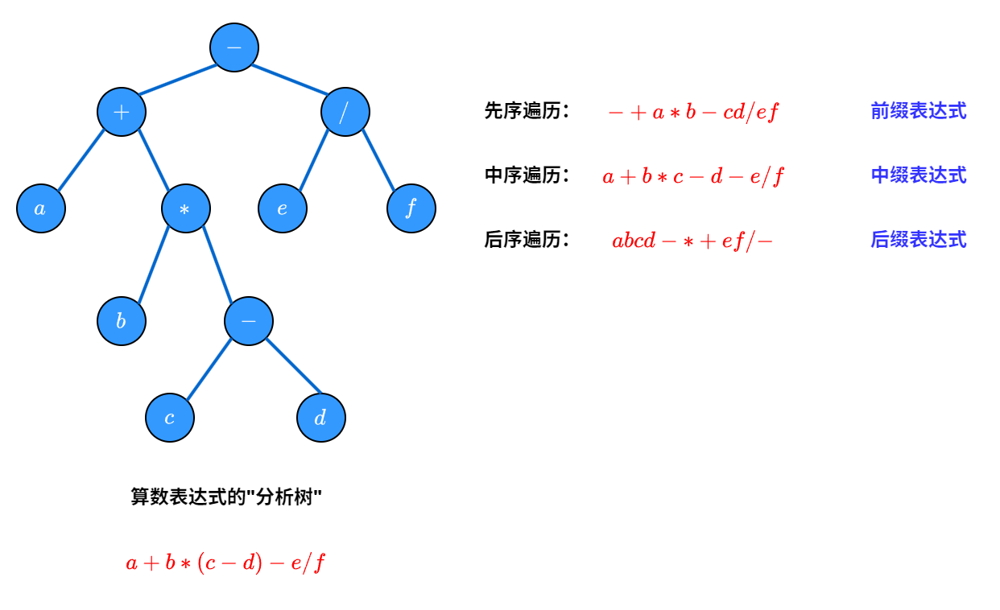

# 树和森林

## 1. 树的基本概念
### 1.1 树的定义
树( $Tree$ )是 $n(n\geq 0)$ 个节点的有限集, 或为空树($n=0$),或为非空树($T$), 对于非空树$T$:
- 1. 有且仅有一个称为<font color="#f79646">根</font>的节点
- 2. 当 $n>1$ 时,除根节点外的节点可以分为 $m$ 个互不相交的有限集 $T_{1},T_{2},\cdots,T_{m}$,每个集合本身也是一棵树,称为根节点的<font color="#f79646">子树</font>($SubTree$)
- 3. 除根节点外,每个节点都有<font color="#8064a2">唯一前驱</font>
- 4. 树中所有节点都可以有<font color="#8064a2">多个或者零个后继</font>


### 1.2 树的基本术语


- (1). <font color="#f79646">节点</font>: 树中的一个独立单元, 包含一个数据元素以及若干指向其子树的分支,如 $A, B, C$
- (2). 节点的<font color="#ff0000">度</font>: 节点拥有的子树数称为节点的度, 如 $Degree(A) = 3, Degree(C) = 1$
- (3). <font color="#ff0000">树的度</font>: 树的度是树内各节点度的最大值, 如 $Degree(Tree) = 3$
- (4). <font color="#ff0000">叶子</font>: 度为 $0$ 的节点称为叶子或终端节点
- (5). <font color="#f79646">非终端节点</font>: 度不为 $0$ 的节点称为非终端节点或分支节点
- (6). <font color="#f79646">双亲和孩子</font>: 节点的子树的根称为该节点的孩子, 相应地, 该节点称为孩子的双亲, 如 $B$ 双亲为 $A$, 孩子为 $E, F$
- (7). <font color="#f79646">兄弟</font>: 同一个双亲的孩子之间互称兄弟, 如 $H, I, J$ 互称兄弟
- (8). <font color="#f79646">祖先</font>: 从根节点到该节点所经分支上的所有节点, 如 $M$ 的祖先为 $A, D, H$
- (9). <font color="#f79646">子孙</font>: 以某节点为根的子树中的任意节点都称该节点的子孙, 如 $B$ 的子孙为 $E, K, L, F$
- (10). <font color="#ff0000">层次</font>: 节点的层次从根开始定义, 根的层次为 $1$, 根的孩子为 $2$, 树中任意节点的层次等于其双亲节点的层次加 $1$
- (11). <font color="#f79646">堂兄弟</font>: 双亲在同一层的节点互称为堂兄弟
- (12). 树的<font color="#ff0000">深度</font>: 树中节点的最大层次称为树的深度或高度
- (13). 有序树和无序树: 如果将树中节点的各子树看成从左到右是有次序的, 则称该树为有序树, 否则称该树为无序树; 有序树中最左边的子树的根称为第一个孩子, 最右边的称最后一个孩子
- (14). <font color="#f79646">森林</font>: $m(m\geq 0)$ 棵互不相交的树的集合, 对于树中每个节点而言, 其子树的集合就是森林
$$\begin{cases}
  Tree = (root, F)\\
  F = (T_{1},T_{2},\cdots,T_{m})\\
  T_{i} = (r_{i}, F_{i})
\end{cases}$$

$$RF = \{<root,r_{i}>|i=1,2,\cdots,m, m> 0\}$$ 

### 1.3 <font color="#de7802">树的性质</font>
- $Node(T) = Degree(T) + 1$
- $m$ 叉树: 树中所有节点的度数不超过 $m$, 可以是空树
- 度为 $m$ 的树: 树中至少有一个节点的度为 $m$, 且树中节点的度数不超过 $m$, 一定是非空树, 至少有 $m+1$ 个节点
- 度为 $m$ 的树第 $i$ 层至多有 $n_{i} = m^{i-1}$ 个节点
- 高度为 $h$ 的 $m$ 叉树至多有 $N = \dfrac{m^{h}-1}{m-1}$ 个节点
- 高度为 $h$ 的 $m$ 叉树至少有 $h$ 个节点
- 高度为 $h$、度为 $m$ 的树至少有 $h + m - 1$ 个节点
- 具有 $n$ 个节点的 $m$ 叉树的最小高度为
$$\dfrac{m^{h-1}-1}{m-1} < n < \dfrac{m^{h}-1}{m-1}\to h-1 < \log_{m}(n(m-1)+1) < h $$

## 2. 二叉树

### 2.1 二叉树的定义

<font color="#ff0000">二叉树</font>($\mathbf{Binary\ Tree}$) 是 $n(n\geq 0)$ 个节点所构成的集合, 或为空树($n=0$), 或为非空树($T$), 对于非空树$T$:
- 1. 有且仅有一个称为<font color="#f79646">根</font>的节点
- 2. 当 $n>1$ 时,除根节点外的节点可以分为 $2$ 个互不相交的有限集 $T_{1},T_{2}$, 每个集合本身也是一棵二叉树,称为根节点的<font color="#f79646">左子树</font>和<font color="#f79646">右子树</font>($SubTree$), 二叉树是有序树
- 3. 二叉树的 $5$ 种形态: 空二叉树、只有根节点的二叉树、右子树为空的二叉树、左右子树均非空的二叉树、左子树为空的二叉树

### 2.2 二叉树的性质

- 二叉树第 $k$ 层最多有 $2^{k-1}$ 个节点
- 高度为 $h$ 的二叉树最多有 $2^{h}-1$ 个节点
- 对于任意一棵二叉树, 如果其叶节点数为 $n_{0}$, 度为 $2$ 的节点数为 $n_{2}$, 度为 $1$ 的节点数为 $n_{1}$:
$$\begin{cases}
  n = n_{0} + n_{1} + n_{2}\\
  n = 2n_{2} + n_{1} + 1
\end{cases}\Rightarrow n_{0} = n_{2} + 1$$

### 2.3 特殊二叉树

#### 2.3.1 <font color="#4f6128">满二叉树</font>
深度为 $k$ 且有 $2^{k-1}$ 个节点的二叉树称为满二叉树
- 1. 满二叉树只有最后一层有叶子节点
- 2. 不存在度为 $1$ 的节点
- 3. 按照层序从 $1$ 开始编号, 编号为 $i$ 的节点的左孩子编号为 $2i$, 右孩子编号为 $2i+1$, 父节点编号为 $[\dfrac{i}{2}]$

#### 2.3.2 <font color="#4f6128">完全二叉树</font>
深度为 $k$ 且有 $n$ 个节点的二叉树, 当且仅当每个节点和高度为 $k$ 的满二叉树编号为 $1\sim n$ 节点一一对应, 且叶节点只能出现在最后两层, 对于最大层的叶节点, 从左到右依次排列, 称为 <font color="#f79646">完全二叉树</font>

- 1. 叶节点编号: $i>[\dfrac{n}{2}]$
- 2. $n$ 个节点的完全二叉树的高度为: $[log_{2}n]+1$
- 3. 对于编号为 $i$ 的节点, 左子树编号为 $2i$, 右子树编号为 $2i+1$, 如果 $2i > n$, 则没有左子树, 如果 $2i+1 > n$, 则没有右子树
- 4. 最多只有一个 $1$ 度节点, 且该节点只有左子树, 没有右子树：
$$\begin{cases}
      n = 2n_{2} + n_{1} + 1\\
      n = n_{0} + n_{1} + n_{2}\\
      n_{1} = 0 \text{ 或 } 1
\end{cases}\Rightarrow 
\begin{cases}
      n_{0} = n_{2} + 1\\
      n_{1} = 0 \text{ 或 } 1
\end{cases}\Rightarrow 
\begin{cases}
      n = 2k + 1，n_{1} = 0, n_{0} = k+1, n_{2} = k \\
      n = 2k，n_{1} = 1, n_{0} = k, n_{2} = k-1
\end{cases}$$
#### 2.3.3 <font color="#4f6128">二叉排序树</font>
- 1. 左子树上所有节点的关键字小于根节点的关键字; 右子树上所有节点的关键字大于根节点的关键字
- 2. 左子树和右子树也分别为二叉排序树

#### 2.3.4 <font color="#4f6128">平衡二叉树</font>
树上任意节点的左子树和右子树的深度之差不超过 $1$


### 2.3 二叉树实现

#### 2.3.1 顺序存储
- 仅适用于完全二叉树, 对于一般树, 会浪费大量空间
- 在最坏的情况下, 一个深度为 $k$ 且只有 $k$ 个节点的单支树, 顺序存储需要 $2^{k}-1$ 个空间

``` c
#define MAXSIZE 100
typedef struct TreeNode
{
    int data;
    bool IsEmpty;
};
TreeNode Tree[MAXSIZE]; 
```

#### 2.3.2 链式存储

``` c
typedef struct BiNode
{
    int data;
    struct BiNode* lchild;
    struct BiNode* rchild;
}BiNode,*BiTree;
```

## 3. 遍历二叉树和线索二叉树

### 3.1 二叉树的遍历


- 二叉树的<font color="#ff0000">前序遍历</font>和<font color="#ff0000">中序遍历</font>可以唯一确定一颗二叉树
- 二叉树的<font color="#ff0000">后序遍历</font>和<font color="#ff0000">中序遍历</font>可以唯一确定一颗二叉树
- 二叉树的<font color="#ff0000">层次遍历</font>和<font color="#ff0000">中序遍历</font>可以唯一确定一颗二叉树
#### 3.1.1 前序遍历
- 先访问根节点, 再访问左子树, 最后访问右子树; <font color="#7030a0">第一次访问顺序</font>

``` c
// 递归实现
void PreOrderTraverse(BiTree T)
{
    if (T)
    {
        visit(T);
        PreOrderTraverse(T->lchild);
        PreOrderTraverse(T->rchild);
    }
}
// 非递归实现
void PreOrderTraverse(BiTree T)
{
    Stack S;
    InitStack(&S);
    BiTree p = T;
    while (p || !IsEmpty(S))
    {
        if (p)
        {
            visit(p);
            Push(&S,p);
            p = p->lchild;
        }
        else
        {
            Pop(&S,p);
            p = p->rchild;
        }
    }
}
```
#### 3.1.2 中序遍历
- 先访问左子树, 再访问根节点, 最后访问右子树; <font color="#7030a0">第二次访问顺序</font>

``` c
// 递归实现
void InOrderTraverse(BiTree T)
{
    if (T)
    {
        InOrderTraverse(T->lchild);
        visit(T);
        InOrderTraverse(T->rchild);
    }
}
// 非递归实现
void InOrderTraverse(BiTree T)
{
    Stack S;
    InitStack(&S);
    BiTree p = T;
    while (p || !IsEmpty(S))
    {
        if (p)
        {
            Push(&S,p);
            p = p->lchild;
        }
        else
        {
            Pop(&S,p);
            visit(p);
            p = p->rchild;
        }
    }
}
```

#### 3.1.3 后序遍历
- 先访问左子树, 再访问右子树, 最后访问根节点; <font color="#7030a0">第三次访问顺序</font>

``` c
// 递归实现
void PostOrderTraverse(BiTree T)
{
    if (T)
    {
        PostOrderTraverse(T->lchild);
        PostOrderTraverse(T->rchild);
        visit(T);
    }
}
// 非递归实现
void PostOrderTraverse(BiTree T)
{
    Stack S;
    InitStack(&S);
    BiTree p = T;
    BiTree r = NULL;
    while (p || !IsEmpty(S))
    {
        if (p) // 一直向左走 
        {
            Push(&S,p);
            p = p->lchild;
        }
        else
        {
            GetTop(S,p); // 左子树为空, 访问右子树
            if (p->rchild && p->rchild != r)
            {
                p = p->rchild;
                Push(&S,p);
                p = p->lchild;
            }
            else
            {
                Pop(&S,p);
                visit(p);
                r = p;
                p = NULL;
            }
        }
    }
}
```


#### 3.1.4 层次遍历

- 从上到下, 从左到右逐层访问

``` c
void LevelOrder(BiTree T)
{
    LinkQueue Q;
    InitQueue(&Q);
    BiTree p;
    EnQueue(&Q,T);
    while (!IsEmpty(Q)){
        DeQueue(&Q,p);
        visit(p);
        if (p->lchild != NULL)
            EnQueue(&Q,p->lchild);
        if (p->rchild != NULL)
            EnQueue(&Q,p->rchild);
    }
}
```
#### 3.1.5 遍历应用

``` c
// 1. 求二叉树的高度
int Depth(BiTree T)
{
    if (T == NULL)
        return 0;
    int l = Depth(T->lchild);
    int r = Depth(T->rchild);
    return l>r? l+1:r+1;
}
// 2. 求二叉树的节点数
int NodeCount(BiTree T)
{
    if (T == NULL)
        return 0;
    int l = NodeCount(T->lchild);
    int r = NodeCount(T->rchild);
    return l+r+1;
}
// 3. 求二叉树的叶子节点数
int LeafCount(BiTree T)
{
    if (T == NULL)
        return 0;
    if (T->lchild == NULL && T->rchild == NULL)
        return 1;
    int l = LeafCount(T->lchild);
    int r = LeafCount(T->rchild);
    return l+r;
}
```
### 3.2 线索二叉树

#### 3.2.1 线索二叉树定义和存储结构
线索二叉树是在二叉树的基础上, 对二叉树的空指针域进行利用, 使其指向该节点在某种遍历次序下的前驱和后继节点, 从而可以在 $O(1)$ 的时间复杂度内找到前驱和后继节点

- 增加两个标志域 $ltag, rtag$, 用来标识指针是指向孩子节点还是前驱后继节点, 如果指针指向孩子节点, 则标志域为 $0$, 如果指针指向前驱后继节点, 则标志域为 $1$

```c
typedef struct BiThrNode{
    int data;
    struct BiThrNode* lchild;
    struct BiThrNode* rchild;
    int ltag,rtag;//指针标识,指针为 1 代表线索
}BiThrNode,*BiThrTree;
```
#### 3.2.2 线索化二叉树

|        | 中序线索二叉树 | 先序线索二叉树 | 后序线索二叉树 |
| :----: | :------------: | :------------: | :------------: |
| 找前驱 |       ✔        |       ✘        |       ✔        |
| 找后继 |       ✔        |       ✔        |       ✘        |

##### 3.2.2.1 中序线索二叉树
- 找前驱：
  > 1. $ltag = 1$, `p->lchild` 为前驱
  > 2. $ltag = 0$, 左子树最右边的节点为前驱
- 找后继：
  > 1. $rtag = 1$, `p->rchild` 为后继
  > 2. $rtag = 0$, 右子树最左边的节点为后继


```c
// 中序线索化
void InThread(BiThrTree T, BiThrTree pre)
{
    if (T != NULL)
    {
        InThread(T->lchild, pre);
        if (T->lchild == NULL)
        {
            T->ltag = 1;
            T->lchild = pre;
        }
        if (pre != NULL && pre->rchild == NULL)
        {
            pre->rtag = 1;
            pre->rchild = T;
        }
        pre = T;
        InThread(T->rchild,pre);
    }
}
// 建立中序线索二叉树
void CreateInThread(BiThrTree T)
{
    BiThrTree pre = NULL;
    if (T != NULL)
    {
        InThread(T,pre);
        if (pre->rchild == NULL)
            pre->rtag = 1;
    }
}
```
##### 3.2.2.2 先序线索二叉树

- 找前驱：
  > 1. $ltag = 1$, `p->lchild` 为前驱
  > 2. $ltag = 0$, 不确定, $p$ 是左子树, 前驱是父节点, $p$ 是右子树, 前驱是左子树最右边的节点
- 找后继：
  > 1. $rtag = 1$, `p->rchild` 为后继
  > 2. $rtag = 0$, 左子树根(存在)或者右子树根


```c
// 先序线索化
void PreThread(BiThrTree T, BiThrTree pre)
{
    if (T != NULL)
    {
        if (T->lchild == NULL)
        {
            T->ltag = 1;
            T->lchild = pre;
        }
        if (pre != NULL && pre->rchild == NULL)
        {
            pre->rtag = 1;
            pre->rchild = T;
        }
        pre = T;
        if (T->ltag == 0)
            PreThread(T->lchild, pre);
        PreThread(T->rchild,pre);
    }
}
// 建立先序线索二叉树
void CreatePreThread(BiThrTree T)
{
    BiThrTree pre = NULL;
    if (T != NULL)
    {
        PreThread(T,pre);
        if (pre->rchild == NULL)
            pre->rtag = 1;
    }
}
```

##### 3.2.2.3 后序线索二叉树

- 找前驱：
  > 1. $ltag = 1$, `p->lchild` 为前驱
  > 2. $ltag = 0$, 且 $rtag = 0$, `p->rchild` 为前驱; $rtag = 1$, `p->lchild` 为前驱
- 找后继：
  > 1. $rtag = 1$, `p->rchild` 为后继
  > 2. $rtag = 0$, 若 $p$ 是根节点, 无后继; 若 $p$ 是右子树, 后继是父节点; 若 $p$ 是左子树, 且父节点无右子树, 后继是父节点; 若 $p$ 是左子树, 且父节点有右子树, 后继是右子树最左边的节点


```c
// 后序线索化
void PostThread(BiThrTree T, BiThrTree pre)
{
    if (T != NULL)
    {
        PostThread(T->lchild, pre);
        PostThread(T->rchild,pre);
        if (T->lchild == NULL)
        {
            T->ltag = 1;
            T->lchild = pre;
        }
        if (pre != NULL && pre->rchild == NULL)
        {
            pre->rtag = 1;
            pre->rchild = T;
        }
        pre = T;
    }
}
// 建立后序线索二叉树
void CreatePostThread(BiThrTree T)
{
    BiThrTree pre = NULL;
    if (T != NULL)
    {
        PostThread(T,pre);
        if (pre->rchild == NULL)
            pre->rtag = 1;
    }
}
```

## 4. 树和森林

### 4.1 树和森林的存储结构

#### 4.1.1 双亲表示法
- 用一组连续的存储单元来存储树中的节点, 并且在每个节点中附设一个指示器指示其双亲节点在数组中的位置
- <font color="#00b050">顺序存储</font>, 优点是<font color="#ff0000">方便找父亲节点</font>, 缺点是<font color="#ff0000">找孩子节点不方便</font>, 只能遍历整个数组


``` c
#define MAXSIZE 100
// 树节点定义
typedef struct PTNode
{
    int data;
    int parent;
}PTNode;
// 用数组来存储树节点
typedef struct PTree
{
    PTNode Nodes[MAXSIZE];
    int n;//节点总数
}PTree;
```

#### 4.1.2 孩子表示法
- 用一组单链表来存储每个节点的孩子节点, 并且在每个节点中附设一个指示器指示其第一个孩子节点
- <font color="#00b050">顺序存储和链式存储</font>相结合, 优点是<font color="#ff0000">方便找孩子节点</font>, 缺点是<font color="#ff0000">找父亲节点不方便</font>


```c
typedef struct CNode
{
    int child;//节点在数组中的位置
    struct CNode* next;//下一个孩子指针
}CNode;

typedef struct CBox
{
    int data;
    struct CNode *firstchild;
}CBox;

typedef struct CTree{
    CBoxs nodes[MAXSIZE];
    int n,r;//节点数和根的位置
}CTree;
```

#### 4.1.3 孩子兄弟表示法
- 二叉链表法, 用二叉链表来表示树, 二叉链表的左孩子指针指向第一个孩子节点, <font color="#00b050">右孩子指针指向下一个兄弟节点</font>

```c
typedef struct CSNode
{
    int data;
    struct CSNode* firstchild;
    struct CSNode* nextsibling;
}CSNode,*CSTree;

```

### 4.2 二叉树、森林和树的转换 (孩子兄弟表示法)

#### 4.2.1 二叉树和树的转换

##### 4.2.1.1 二叉树 $\to$ 树🌳 (右子树是兄弟节点)


##### 4.2.1.2 树🌳 $\to$ 二叉树 (兄弟节点是右子树)


#### 4.2.2 二叉树和森林的转换

##### 4.2.2.1 二叉树 $\to$ 森林 
- 二叉树分为 $n$ 棵子树, 每棵子二叉树转为树🌳


##### 4.2.2.2 森林 $\to$ 二叉树 
- 森林每棵子树转化为二叉树, 根节点作为右子树连接


### 4.3 树和森林的遍历

#### 4.3.1 树的遍历

##### 4.3.1.1 先根遍历

- 先访问根节点, 再依次先根遍历每个子树
- 树的<font color="#00b050">先根遍历序列</font>和对应的二叉树的<font color="#00b050">先序遍历序列</font>相同

##### 4.3.1.2 后根遍历

- 先依次后根遍历每个子树, 再访问根节点
- 树的<font color="#ff0000">后根遍历序列</font>和对应的二叉树的<font color="#ff0000">中序遍历序列</font>相同

#### 4.3.2 森林的遍历

- 先序遍历: 森林的先序遍历是所有树的先序遍历序列的总和
- 中序遍历: 森林的中序遍历是所有树的中序遍历序列的总和
## 5. 树和树的应用

### 5.1 哈夫曼树

#### 5.1.1 哈夫曼树的基本概念

- 路径: 从树中一个节点到另一个节点之间的分支构成这个两个节点之间的路径
- 路径长度: 路径上的分支数目称为路径长度
- 树的路径长度: 从树根到每一节点的路径长度之和
- 权: 节点上的一个数值称为节点的权; 边上的一个数值称为边的权
- 节点的带权路径长度: 从树根到该节点的路径长度与该节点的权的乘积
- 树的带权路径长度: <font color="#00b050">树中所有叶节点的带权路径长度之和</font> $WPL = \sum\limits_{k=1}^{n}w_{k}l_{k}$

假设有 $n$ 个权值 $\{w_{1},w_{2},\cdots,w_{n}\}$, 可以构造一棵含有 $n$ 个叶子节点的二叉树, 每个叶子节点的权值为 $w_{i}$, 其中带权路径长度 $WPL$ 最小的二叉树称为最优二叉树或者哈夫曼树 

#### 5.1.2 哈夫曼树的构造


> 1. 根据给定的 $n$ 个权值 $\{w_{1},w_{2},\cdots,w_{n}\}$, 构造 $n$ 棵只有根节点的二叉树, 将这些二叉树组成一个森林 $F$
> 2. 在 $F$ 中选取两棵根节点的权值最小的树作为左右子树构造一棵新的二叉树, 且新的二叉树的根节点的权值为其左右子树根节点的权值之和
> 3. 在 $F$ 中删除这两棵树, 将新的二叉树加入 $F$
> 4. 重复 $2,3$ 步骤, 直到 $F$ 中只有一棵树为止, 这棵树即为哈夫曼树

#### 5.1.3 哈夫曼编码

- 前缀编码: 任何一个编码都不是其他任何编码的前缀 (无二义性)
- 哈夫曼编码: 对于一棵拥有 $n$ 个叶子的哈夫曼树, 对树中左分支赋 $0$, 右分支赋 $1$, 从根节点到叶子节点的路径上的 $0,1$ 序列即为该叶子节点的哈夫曼编码
  > 1. 哈夫曼编码是一种前缀编码, 可变长度编码
  > 2. 哈夫曼编码是最优前缀编码

### 5.2 并查集
- 并查集是一种树形数据结构, 用于处理一些不相交集合的合并和查询问题
- 并查集的基本操作: 初始化、查找、合并
- 用森林来表示总体, 总体里各个集合代表互不相交的子树, 采用双亲表示法

```c
#define SIZE 50；
int UFSets[SIZE];
// 初始化
void Initial(int s[])
{
    for (int i = 0; i < SIZE; i++)
        s[i] = -1;
}
// 查找 O(n)
int Find(int s[],int x)
{
    while(s[x]>=0)
    {
        x=s[x]
    }
    return x;
}
// 合并
void Union(int s[],int Root1,int Root2)
{
    if (Root1==Root2) return ;
    s[Root2]=Root1;
}

// 查找 (降低树的高度) O(log n)
int Find(int s[],int x)
{
    int root=x;
    while(s[root]>=0) root=s[root];
    while(x!=root){
        int t=s[x];
        s[x]=root;
        x=t;
    }
    return root;
}


// 合并 小树合并到大树

void Union(int s[],int Root1,int Root2)
{
    if (Root1==Root2)
        return ;
    if (s[Root1]<s[Root2])
    {
        s[Root1]+=s[Root2];
        s[Root2]=Root1;
    }
    else
    {
        s[Root2]+=s[Root1];
        s[Root1]=Root2;
    }
}

```

[**Disjoint Sets**](https://www.cs.usfca.edu/~galles/visualization/DisjointSets.html)