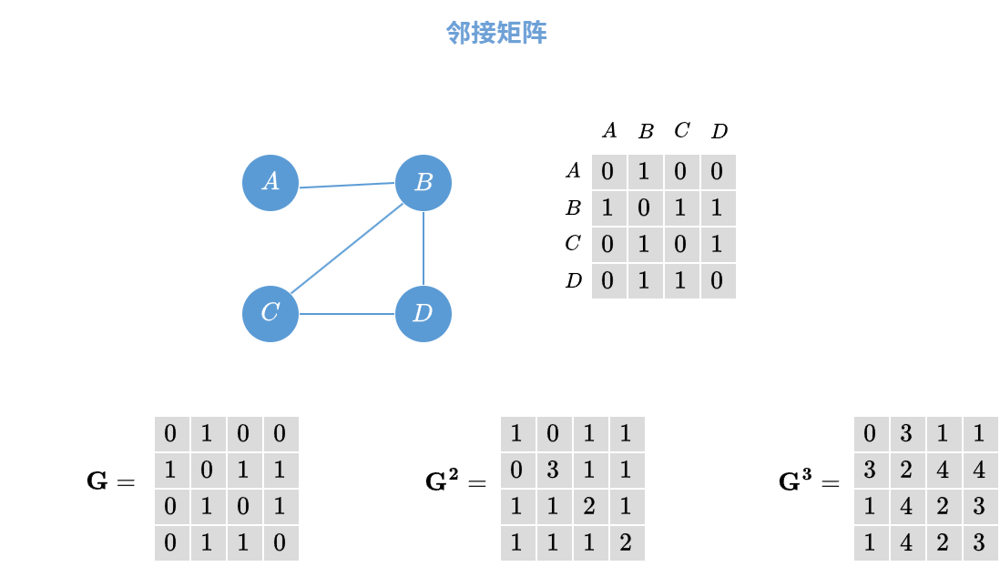
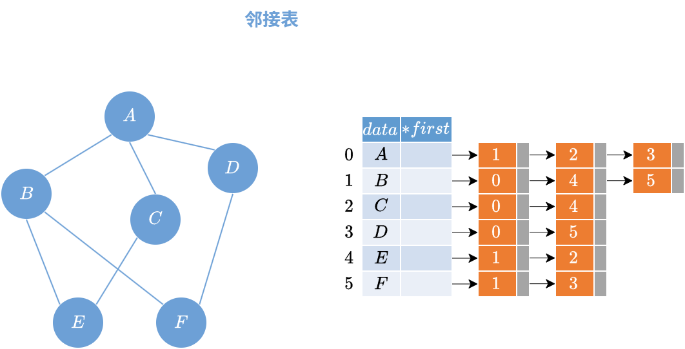
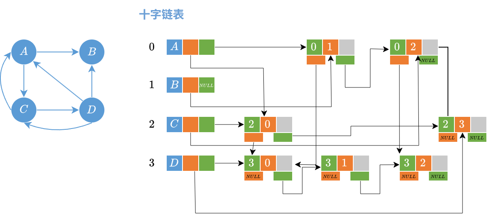
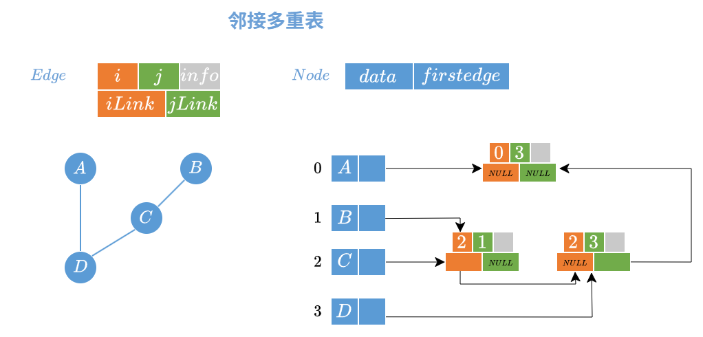
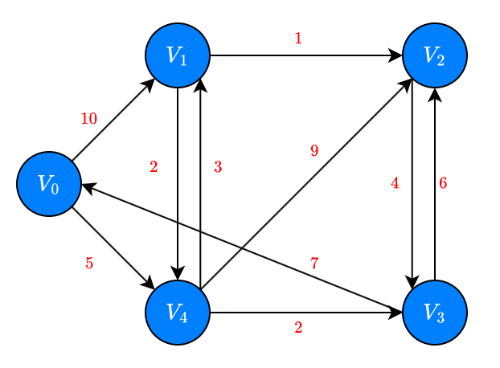

# 图

## 1. 图的定义和基本术语

### 1.1 图的定义

**图** ($\mathbf{Graph}$) $G$ 由两个集合 $V$ 和 $E$ 组成, 记作 $G = (V,E)$, 其中 $V$ 是顶点的有限非空集合, 称为点集; $E$ 是 $V$ 中定点偶对的有穷集合, 称为边集; $V(G)$ 表示图 $G$ 中顶点的集合, $E(G)$ 表示图 $G$ 中边的集合

- **有向图** ($\mathbf{Directed\ Graph}$)：有向图是由顶点集和边集组成的, <font color="#00b050">每条边是一个有序对</font>, 记作 $<v_{i},v_{j}>$, 表示从顶点 $v_{i}$ 到顶点 $v_{j}$ 的有向边
- **无向图** ($\mathbf{Undirected\ Graph}$)：无向图是由顶点集和边集组成的, <font color="#00b050">每条边是一个无序对</font>, 记作 $\{v_{i},v_{j}\}$, 表示顶点 $v_{i}$ 和顶点 $v_{j}$ 之间有边
- **简单图** ($\mathbf{Simple\ Graph}$)：无向图中, 任意两个顶点之间最多只有一条边, 且没有顶点到自身的边; 有向图中, 任意两个顶点之间某一方向最多只有一条边, 且没有顶点到自身的边
- **多重图** ($\mathbf{Multi\ Graph}$)：无向图中, 任意两个顶点之间可能有多条边; 有向图中, 任意两个顶点之间可能有多条边

### 1.2 点集和边集

#### 1.2.1 顶点的度

- **度** ($\mathbf{Degree}$)：无向图中, 与顶点 $v$ 相关联的边的数目称为顶点 $v$ 的度, 记作 $TD(v)$; 有向图中, 顶点的度包括入度和出度, 记作 $TD(v) = ID(v) + OD(v)$
- **入度** ($\mathbf{In\ Degree}$)：有向图中, 以顶点 $v$ 为终点的边的数目称为顶点 $v$ 的入度, 记作 $ID(v)$
- **出度** ($\mathbf{Out\ Degree}$)：有向图中, 以顶点 $v$ 为起点的边的数目称为顶点 $v$ 的出度, 记作 $OD(v)$
$$\begin{cases}
    \sum\limits_{i=1}^{n}TD(v_{i}) = 2 \big|E\big|\\
    \sum\limits_{i=1}^{n}ID(v_{i}) = \sum\limits_{i=1}^{n}OD(v_{i}) = \big|E\big|
\end{cases}$$

#### 1.2.2 路径和回路

- **路径** ($\mathbf{Path}$)：顶点 $v_{p}$ 到顶点 $v_{q}$ 之间的一条路径是顶点序列 $v_{p},v_{i_{1}},v_{i_{2}},\cdots,v_{q}$
- **回路** ($\mathbf{Cycle}$)：第一个顶点和最后一个顶点相同的路径称为<font color="#00b050">回路</font>或<font color="#00b050">环</font>
- **简单路径** ($\mathbf{Simple\ Path}$)：除了第一个顶点和最后一个顶点外, 其余顶点均不相同的路径
- **简单回路** ($\mathbf{Simple\ Cycle}$)：除了第一个顶点和最后一个顶点外, 其余顶点均不相同的回路
- **路径长度**：路径上边的条数称为路径的长度
- **点到点的距离**：从顶点 $v_{p}$ 到顶点 $v_{q}$ 的最短路径长度若存在, 称为顶点 $v_{p}$ 到顶点 $v_{q}$ 的距离, 记作 $d(v_{p},v_{q})$；若不存在, 记作 $d(v_{p},v_{q}) = +\infty$

#### 1.2.3 连通性

- **连通图** ($\mathbf{Connected\ Graph}$)：无向图中, 任意两个顶点之间都有路径存在, 称为连通图
- **强连通图** ($\mathbf{Strongly\ Connected\ Graph}$)：有向图中, 任意两个顶点之间都有路径存在, 称为强连通图

> 1. 对于 $n$ 个节点的无向图, 如果是连通图, 至少有 $n-1$ 条边；如果是非连通图, 至多有 $C_{n-1}^{2}$ 条边 
> 2. 对于 $n$ 个节点的有向图, 如果是强连通图, 至少有 $n$ 条边

### 1.3 子图和生成子图

### 1.4 特殊图


- ==连通分量==:==无向图==中的==极大==连通子图

- ==强连通分量==:==有向图==的极大强连通子图

- ==生成树==:连通图的生成树是包含全部顶点的一个==极小连通子图==

- ==生成森林==:非连通图中,连通分量的生成树构成了非连通图的==生成森林==

- ==带权图、带权路径==:前者指的是图中边带有权值；后者指的是==一条路径上所有权值之和==

- ==完全图==:任意两个顶点之间都存在边；对于无向图,$|E|\in [0,C_{n}^{2}]$；对于有向图,$|E|\in[0,2C_{n}^{2}]$

- ==稀疏图==:边数量很少的图,标准没有绝对的界限,一般$|E|<|V|log|V|$


## 2. 图的类型定义


## 3. 图的存储结构

- 只与==顶点数$|V|$==有关,与边的数量无关

  ```c
  #define MAXVertexNum 100
  #define INFINTY
  typedef struct {
      char Vex[MAXVertexNum];
      int Edge[MAXVertexNum][MAXVertexNum];
      int vexnum,edgenum;//顶点数和边的数量
  }
  ```

- 空间复杂度$O(|V|^{2})$,适用于稠密图；计算入度和出度时间复杂度为$O(|V|)$



## 2. 邻接表（类似于==树的孩子表示法==）

```c
typedef struct ArcNode{
    int adjvex;
    struct ArcNode *next
}ArcNode;
typedef struct VNode{
    int data;
    ArcNode* first;
}VNode,AdjList[MAXVertexNum];
```




## 3. 十字链表（==有向图==）



## 4. 邻接多重表（==无向图==）




|            | 邻接表           | 邻接矩阵      | 十字链表 | 邻接多重表 |    
| ---------- | ------------- | --------- | ---- | ----- | 
| 空间复杂度      | 无向图$O(V+2E)$,有向图$O(V+E)$  | $O( V ^2)$ | $O( V+E)$  | $O(V+E)$|
| 适用情况       | 存储稀疏图         | 存储稠密图     | 有向图  | 无向图   |     
| 表示方式       | 不唯一           | 唯一        | 不唯一  | 不唯一   |  
| 计算度(入度、出度) | 计算有向图的度、入度不方便 | 遍历对应的行或者列 | 方便   | 方便    |     
| 找相邻的边      | 找有向图的入边不方便    | 遍历对应的行或者列 | 方便   | 方便    |

## 4. 图的遍历

```c
Adjacent(G,x,y);//判断图G是否存在边(x,y)
Neighbors(G,x);//列出与顶点x相邻的边
InSertVertex(G,x);//在图G中插入顶点x
DeleteVertex(G,x);//从图G中删除顶点x
AddEdge(G,x,y);//如果图G中不存在(x,y)或者<x,y>,添加边
RemoveEdge(G,x,y);//如果图G中存在(x,y)或者<x,y>,删除边
FirstNeighbor(G,x);//求图G中顶点x的第一个邻接点,不存在返回-1
NextNeighbor(G,x,y);//求图G中顶点x除了y的第一个邻接点,不存在返回-1
Get_edge_value(G,x,y);
Set_edge_value(G,x,y);
```

## 四、图的遍历（$DFS\Rightarrow\text{栈}$,$BFS\Rightarrow\text{队列}$）

**树的遍历不需要考虑已经访问过的节点,图需要考虑节点是否被访问过**

### 1. BFS  广度优先搜索

- 图非空,第一个节点入队

- 如果队列非空,队头元素出队并访问,同时将该元素的邻接点加入队列,重复操作至队列为空

  ```c
  #define MAXSIZE 100 
  bool visited[MAXSIZE];
  void BFSTraverse(Graph G)
  {
      for (int i=0;i<G.vexnum;i++)
          visited[i]=false;
      InitQueue(Q);
      for(int i=0;i<G.vexnum;i++){
          if (!visited[i])
              BFS(G,i);
      }
  }
  
  void BFS(Graph G,int v)
  {
      visit(v);
      visited[v]=true;
      EnQueue(Q,v);
      while(!IsEmpty(Q))
      {
          DeQueue(Q,v);
          for (w=FirstNeighbor(G,v);w>=0;w=NextNeighbor(G,v,w))
          {
              if (!visited[w]){
                  visit(w);
                  visited[w]=true;
                  EnQueue(Q,w);
              }
          }
      }
  }
  ```


### 2. DFS  深度优先搜索

```c
//递归实现
#define MAXSIZE 100 
bool visited[MAXSIZE];
void BFSTraverse(Graph G)
{
    for (int i=0;i<G.vexnum;i++)
        visited[i]=false;
    for(int i=0;i<G.vexnum;i++){
        if (!visited[i])
            DFS(G,i);
    }
}

void DFS(Graph G,int v)
{
    visit(v);
    visited[v]=true;
    for (w=FirstNeighbor(G,v);w>=0;w=NextNeighbor(G,v,w))
    {
        if (!visited[w]){
            visit(w);
            DFS(G,w);
        }
    }
}
//非递归实现
```

==对于非连通图,无法遍历所有节点；调用$BFS\text{和}DFS$函数次数$=$连通分量数==

1. **空间复杂度:最坏情况下,辅助队列大小为$O(|V|)$**

2. **广度优先生成树:广度优先遍历确定的树；深度优先生成树:深度优先遍历确定的树**
3. ==邻接表==存储的图生成树==不唯一==,==邻接矩阵==存储的图生成树==唯一==
4. **遍历非连通图可以得到广度优先森林和深度优先森林**


| 表示形式 | 邻接矩阵 | 邻接表 |
| ---- | ---- | --- |
| **时间复杂度**     |  $O(V^2)$    | $O(V+E)$     |
| **空间复杂度**     |  $O(V)$    |  $O(V)$   |

## 五、最小生成树和最短路径

### 1. 最小生成树

==连通图的生成树是包含图中全部顶点的一个极小连通子图==

**对于一个带权连通无向图$G=(V,E)$,生成树不同,设$R$是$G$所有生成树的集合,若$T$是集合$R$中所有边权值之和最小的生成树,称$T$为$G$的最小生成树**

==求最小生成树算法==

- $Prim$算法       **时间复杂度:$O(|V|^2)$,适用于边稠密图**

  ==从某一个顶点开始构建生成树；每次将代价最小的顶点纳入生成树直到所有的顶点都在生成树内==

- $Kruskal$算法      **时间复杂度:$O(|E|log_{2}|E|)$,适用于边稀疏图**

  每次选择一条权值最小的边,使这条边的两头连通（已经连通的不选）,直到所有节点连通

### 2. 最短路径问题

####   单源最短路径 ==$BFS$算法==（无权图）

```c
//path[]记录路径; d[]记录长度
#define MAXSIZE 100 
bool visited[MAXSIZE];
int d[MAXSIZE];
int path[MAXSIZE];
void BFS_MIN_Distance(Graph G,int u)
{
    for (int i=0;i<G.vexnum;i++)
    {
        d[i]=+infty;
        path[i]=-1
    }
    d[u]=0;
    visited[v]=true;
    EnQueue(Q,v);
    while(!IsEmpty(Q))
    {
        DeQueue(Q,v);
        for (w=FirstNeighbor(G,v);w>=0;w=NextNeighbor(G,v,w))
        {
            if (!visited[w]){
                d[w]=d[u]+1;
                path[w]=u;
                visited[w]=true;
                EnQueue(Q,w);
            }
        }
    }
}
```

####   单源最短路径 ==$Dijkstra$算法==（带权图和无权图）==权值为正==

- 将开始节点的所有边加入最小堆,选择堆顶元素,然后将堆顶元素的边加入,重新计算与开始节点的距离,将最小堆重新排序
- 重复上述步骤直至所有节点都选择完毕



| 顶点            | $v_{0}$ | $v_{4}$ | $v_{1}$ |
| --------------- | ------- | ------- | ------- |
| 距离$V_{0}$距离 | 0       | 5       | 10      |

我们将$v_{0}$出堆,选择最小的距离$v_{0}v_{4}$,将$v_{4}$的边$\{v_{1}、v_{3}、v_{2}\}$加入堆,已经访问的节点$\{v_{0}、v_{4}\}$

| 顶点            | $v_{3}$ | $v_{1}$ | $v_{2}$ |
| --------------- | ------- | ------- | ------- |
| 距离$V_{0}$距离 | 7       | 8       | 14      |

我们将$v_{3}$出堆,加入$v_{3}$的边$\{v_{2}、v_{0}\}$,已经访问的节点$\{v_{0}、v_{4}、v_{3}\}$

| 顶点            | $v_{1}$ | $v_{2}$ |
| --------------- | ------- | ------- |
| 距离$V_{0}$距离 | 8       | 13      |

我们将$v_{1}$出堆,加入$v_{1}$的边$\{v_{2}、v_{4}\}$,已经访问的节点$\{v_{0}、v_{4}、v_{3}、v_{1}\}$

| 顶点            | $v_{2}$ |
| --------------- | ------- |
| 距离$V_{0}$距离 | 9       |

将$v_{2}$出堆,所有元素都已访问

#### 各顶点之间最短路径==$Floyd$算法==  不能解决负权回路

```c
//Floyd算法,动态规划思想
for (int k=0;k<n;k++)//以vk作为中转点
{
    for (int i=0;i<n;i++)
    {
        for (int j=0;j<n;j++)
        {
            if (A[i][j]>A[i][k]+A[k][j])
            {
                A[i][j]=A[i][k]+A[k][j];
                path[i][j]=k;
            }
        }
    }
}
```

## 六、有向无环图 $DAG$

- **有向无环图:若一个有向图中不存在环,则称为有向无环图,简称为$DAG$**

$DAG$**描述表达式**

- 将操作数不重复的列出然后标注计算顺序
- 合并多余的操作符

## 七、拓朴排序

$AOV$网一定是$DAG$

- 寻找入度为$0$的节点,将这个节点入栈
- 将栈中元素出栈,删除与这个节点形成的边
- 重复前两步直到图中没有入度为$0$的节点

```c
//邻接表实现图
typedef struct ArcNode{
    int adjvex;
    atruct ArcNode* nextarc;
}ArcNode;
typedef struct VNode{
    int data;
    ArcNode*firstarc;
}VNode,AdjList[MAXSIZE];
typedef struct Graph{
    AdjList vertices;//节点列表
    int vexnum,arcnum;//节点数和边数
}Graph;

bool TopologicalSort(Graph G)
{
    int print[G.vexnum];
    InitStack(S);
    for (int i=0;i<G.vexnum;i++)
    {
        if (Indegree[i]==0)
            push(S,i);
    }
    int count=0;
    while (!IsEmpty(S))
    {
        pop(S,i);
        print[count++]=i;
        for (p=G.vertices[i].firstarc;p;p=p->nextarc)
        {
            v=p->adjvex;
            if(!(--Indegree[v]))
                Push(S,v);
        }
    }
    if (count<G.vexnum)
        return false;
    else
        return true;
}
//正向输出print是拓朴排序,反向输出是逆拓朴排序
```

### **逆拓朴排序**

```c
//BFS
#define MAXSIZE 100 
bool visited[MAXSIZE];
void BFSTraverse(Graph G)
{
    for (int i=0;i<G.vexnum;i++)
        visited[i]=false;
    for(int i=0;i<G.vexnum;i++){
        if (!visited[i])
            DFS(G,i);
    }
}

void DFS(Graph G,int v)
{
    visited[v]=true;
    for (w=FirstNeighbor(G,v);w>=0;w=NextNeighbor(G,v,w))
    {
        if (!visited[w]){
            visit(w);
            DFS(G,w);
        }
        print(v);
    }
}
```

## 八、关键路径

$AOE$网络

- 以顶点表示时间,有向边表示活动,边上的权值表示活动的开销
- **仅有一个入度为$0$的顶点,称为开始顶点**（==源点==）
- **仅有一个出度为$0$的顶点,称为结束顶点**（==汇点==）
- 从源点到汇点的有向路径最大长度的路径称为==关键路径==,关键路径上的活动称为==关键活动==

### 1. 先进行拓朴排序,计算每个时间的最早发生时间$ve$

### 2. 逆拓朴排序顺序,根据最后一个节点来计算每个节点的最晚发生时间$vl$

### 3. 求每个时间的时间余量$d$,取$d=0$的活动就是关键活动,所有关键活动连接就是关键路径.

- 增加关键活动时间,工程时间增加
- 缩短关键活动时间,工程时间缩短；关键活动可能变为非关键活动

