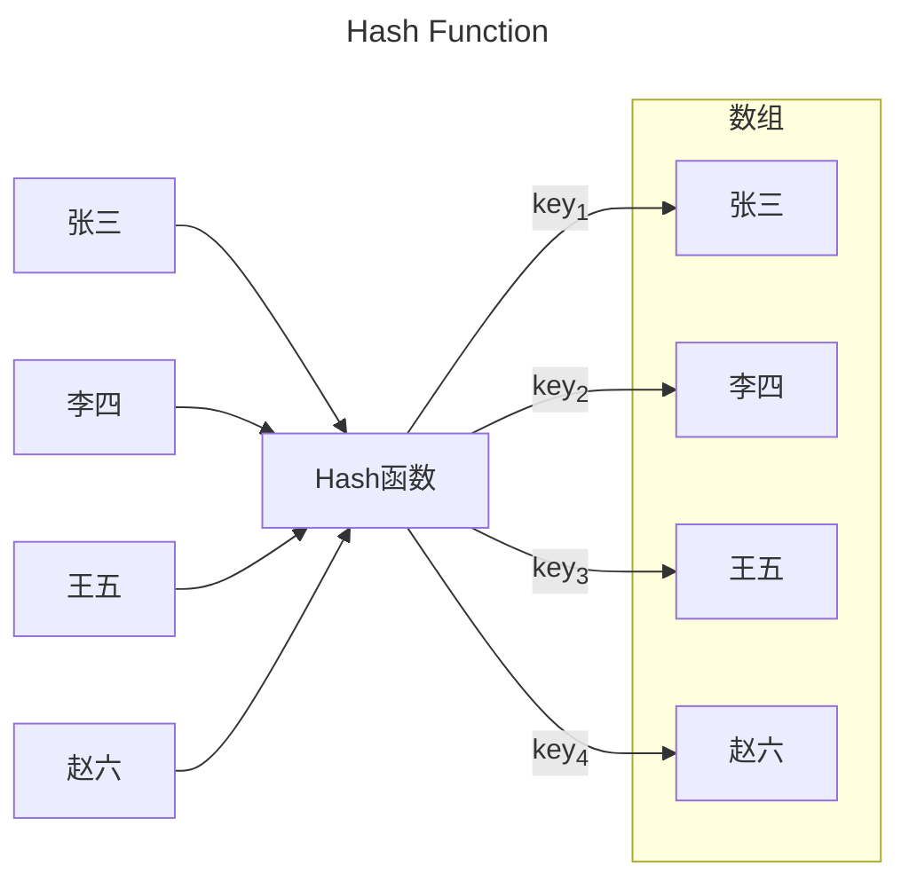

---
tags:
  - 算法分析
---
##### 算法设计是理论研究,是关于计算机程序性能和资源利用的研究

## 1. 渐进符号

大O表示法:

$f(n)=O(g(n))$,$\exists \quad c>0,n_{0}>0$,当$n>n_{0}$,我们有$0 \leq f(n)\leq cg(n)$


大$\Omega$表示法:

$f(n)=\Omega(g(n))$,$\exists \quad c>0,n_{0}>0$,当$n>n_{0}$,我们有$0 \leq cg(n)\leq f(n)$


大$\Theta$表示法:

$f(n)=\Theta(g(n))$,$\exists \quad c_{1},c_{2}>0,n_{0}>0$,当$n>n_{0}$,我们有$c_{1}g(n) \leq f(n)\leq c_{2}g(n)$


小$o$表示法:

$f(n)=o(g(n))$,$\exists \quad c>0,n_{0}>0$,当$n>n_{0}$,我们有$0 \leq f(n)< cg(n)$


小$\omega$表示法:

$f(n)=\omega(g(n))$,$\exists \quad c>0,n_{0}>0$,当$n>n_{0}$,我们有$0 \leq cg(n)<f(n)$

**算法分析时间复杂度三种方法:**

- **主定理**
- **递归树方法**
- **代换法分析,先猜测,再用数学归纳法证明**

## 2. 排序算法

- 比较排序（决策树）堆排序和归并排序渐进最优

输入一组序列
$$
a_{1},a_{2},a_{3},...a_{n}
$$
输出从小到大的序列
$$
b_{1},b_{2},b_{3}...b_{n}
$$

##### 1.插入排序

``` c
#include <stdio.h>
//插入排序
int main()
{
	int array[10]={0,12,3,7,9,15,22,34,19,11};
	int key,j,i;


	for (int i = 0; i < 10; i++)
	{
		key = array[i];
		j = i - 1;
		while (j >= 0 && array[j] > key)
		{
			array[j+1] = array[j];
			array[j] = key;
			j--;
		}
	}
	return 0;

}
```

##### 2.归并排序

``` c

```


$$
T(n)=\left\{ \begin{matrix}
\Theta(1),n=1\\
2T(\frac{n}{2})+\Theta(n),\ n\geq2
\end{matrix}
\right.
$$

##### 3.快速排序

``` c
#include <stdio.h>

int main()
{
    
    return 0;
}
```

**算法分析**

$T(n)=T(n)+T(n)+\Theta(n)$ 或者 $T(n)=T(n-k)+T(k)+\Theta(n)$ 

前者是最坏的情况,后者是一般情况

随机化选择主元,我们使用随机数来生成一个数字 $m$ ,选择数组中第 $m$ 个元素作为主元,算法的运行效率的最差情况不由数组的输入形式决定,而是由随机化生成的数来决定

我们引入指示器随机变量$x_{k}=1 \ or \ 0$,表示的是一种分划:当 $x_{k}=k$ 时,表示分划为 $[k,n-k]$ ,我们得到:
$$
T(n)=\sum_{k=0}^{n}x_{k}\ \{ T(k)+T(n-k)+\Theta(n) \}
$$
我们有:
$$\begin{align*}
	E(T(n))&=E(\sum_{k=0}^{n}x_{k}\{ T(k)+T(n-k)+\Theta(n)\})\\
	&=\sum_{k=0}^{n}E(x_{k}\{ T(k)+T(n-k)+\Theta(n)\})
\end{align*}$$

我们将这个式子化简为:
$$\begin{align*}
E(T(n))&=\frac{1}{n}\sum_{k=0}^{n}E(\ T(k)+T(n-k)+\Theta(n))
\\
E(T(n))&=\frac{2}{n}\sum_{k=0}^{n}E(T(k))+\Theta(n)
\end{align*}$$

我们在这里使用代换法来证明这个:
前提知识:

$$\sum_{k=2}^{n}k\ log\ k\le \frac{1}{2}n^{2}log\ n-\frac{1}{8}n^{2}$$

我们假设:

$$E(T(n))\le c\ nlg\ n$$

通过代换法得到:
$$\frac{2}{n}\sum_{k=0}^{n}E(T(k))\le \frac{2}{n}c\ (\sum_{k=2}^{n}klog\ k) \le cn\ log\ n-\frac{cn}{4}$$

$$E(T(n))\le cn\ log\ n-(\frac{cn}{4}-\Theta(n))\to \lim \limits_{c\to +\infty}E(T(n))\le cn\ log\ n$$

##### 4.计数排序

##### 5.基数排序

## 3. 递归主定理

$T(n)=a T(\frac{n}{b})+f(n)$,其中$a\geq 1$,$f(n)$渐进趋正

其中:

1. n是问题规模
2. a是原问题的子问题的个数
3. $\frac{n}{b}$是每个子问题的大小,假设每个子问题都有相同规模的大小
4. $f(n)$是将原问题分解为子问题和将子问题的解合并为原问题的解的时间

比较 $n^{log_{b}a}$ 与 $f(n)$ ,哪个大选哪个,相等则为 $\Theta(\ n^{log_{b}a}log\ n\ )$

- Case 1

$if\ \exists \ \xi>0, f(n)=O(n^{log_{b}a-\xi}),\ T(n)=\Theta(n^{log_{b}a})$

- Case 2

$if \ f(n)=\Theta(n^{log_{b}a}log^{k}n),with \ k\geq 0,\ T(n)=\Theta(n^{log_{b}a}log^{k+1}n)$,一般情况下$k=0$

- Case 3

$if\ \exists \ \xi>0, f(n)=O(n^{log_{b}a+\xi}),and\ \exists \ c<1,when \ n>n_{0},\ af(\frac{n}{b})\leq cf(n),\ T(n)=\Theta(f(n))$

## 4. 分治法

1. 分——将原问题分为若干个子问题
2. 治——求解子问题的解
3. 合——将子问题的解合并为原问题的解

- 二分搜索
- 求$x^{n}$
- 斐波那契数列

​		$F(n)=\left\{\begin{matrix}0,n=0\\1,n=1\\F(n-1)+F(n-2),n\geq 2\end{matrix}\right.$

​		$\left[\begin{matrix}F_{n+1}&F_{n}\\F_{n}&F_{n-1}\end{matrix}\right]=\left[\begin{matrix}1&1\\1&0\end{matrix}\right]^{n}$

证明:(**数学归纳法**)

1. 当$n=1$时显然成立

2. 假设当$n=k$时上面的式子成立,$\left[\begin{matrix}F_{k+1}&F_{k}\\F_{k}&F_{k-1}\end{matrix}\right]=\left[\begin{matrix}1&1\\1&0\end{matrix}\right]^{k}$

3. 当$n=k+1$时,我们要证明$\left[\begin{matrix}F_{k+2}&F_{k+1}\\F_{k+1}&F_{k}\end{matrix}\right]=\left[\begin{matrix}1&1\\1&0\end{matrix}\right]^{k+1}$

   上式可以等价为证明:$\left[\begin{matrix}F_{k+2}&F_{k+1}\\F_{k+1}&F_{k}\end{matrix}\right]=\left[\begin{matrix}1&1\\1&0\end{matrix}\right]^{k}\left[\begin{matrix}1&1\\1&0\end{matrix}\right]$,即$\left[\begin{matrix}F_{k+2}&F_{k+1}\\F_{k+1}&F_{k}\end{matrix}\right]=\left[\begin{matrix}F_{k+1}&F_{k}\\F_{k}&F_{k-1}\end{matrix}\right]\left[\begin{matrix}1&1\\1&0\end{matrix}\right]$

   我们要证明:$\left[\begin{matrix}F_{k+2}&F_{k+1}\\F_{k+1}&F_{k}\end{matrix}\right]=\left[\begin{matrix}F_{k+1}+F_{k}&F_{k+1}\\F_{k}+F_{k-1}&F_{k}\end{matrix}\right]$,这个矩阵恒成立,原式得证.


- 矩阵乘法

$A,B$是$n\times n$的矩阵,$C=AB$,我们不妨令$A=\left[\begin{matrix}A_{1}&A_{2}\\A_{3}&A_{4}\end{matrix}\right]$,$B=\left[\begin{matrix}B_{1}&B_{2}\\B_{3}&B_{4}\end{matrix}\right]$,$C=\left[\begin{matrix}C_{1}&C_{2}\\C_{3}&C_{4}\end{matrix}\right]$,由矩阵的乘法,我们可以得到:
$$
\left\{\begin{matrix}C_{1}=A_{1}B_{1}+A_{2}B_{3}\\C_{2}=A_{1}B_{2}+A_{2}B_{4}\\C_{3}=A_{3}B_{1}+A_{4}B_{3}\\C_{4}=A_{3}B_{2}+A_{4}B_{4}\end{matrix}\right.
$$
我们发现我们需要计算 $8$ 个$\dfrac{n}{2}\times \dfrac{n}{2}$的矩阵的乘积,然后对他们进行矩阵的求和,因此我们不难得到矩阵相乘过程中时间复杂度的递推关系式:==$$T(n)=8T(\dfrac{n}{2})+\Theta(n^{2})$$==

我们应用主定理,不难得出:==$T(n)=\Theta(n^{3})$==

- **Strassen** 算法

同上面的方法类似,我们只是令:
$$
\left\{\begin{align}M_{1}&=A_{1}(B_{2}-B_{4})\\M_{2}&=(A_{1}+A_{2})B_{4}\\M_{3}&=(A_{3}+A_{4})B_{1}\\M_{4}&=(B_{3}-B_{1})A_{4}\\M_{5}&=(A_{1}+A_{4})(B_{1}+B_{4})\\M_{6}&=(A_{2}-A_{4})(B_{3}+B_{4})\\M_{7}&=(A_{1}-A_{3})(B_{1}+B_{2})\end{align}
\right.
$$
由此我们得出:
$$
\left\{\begin{align}
C_{1}&=M_{5}+M_{4}-M_{2}+M_{6}\\C_{2}&=M_{1}+M_{2}\\C_{3}&=M_{3}+M_{4}\\C_{4}&=M_{5}+M_{1}-M_{3}-M_{1}
\end{align}
\right.
$$
我们发现只需要计算 $7$ 个$\dfrac{n}{2}\times\dfrac{n}{2}$的矩阵的乘积,然后进行一些矩阵的求和运算,我们得到一个递推关系式:

$$T(n)=7T(\frac{n}{2})+\Theta(n^{2})$$

于是我们得到:$T(n)=\Theta(n^{lg_{2}7})$

## 5. 顺序统计、中值

#### 1. **随机选择算法**:平均的时间复杂度$\Theta(n)$ ,最坏情况下$\Theta(n^{2})$

- 求数组中第 $k$ 小的元素（假设元素都不相等）

- 使用快速排序中的方法,将数组的某一部分进行分划并返回中值的位置,比较中值的序号和所求的序号 

**算法分析**:$T(n)=T(n-1)+\Theta(n)$ 或者 $T(n)=T(b\ n)+\Theta(n)$ ,前者是最坏的情况,后者是一般情况

我们引入指示器随机变量$x_{k}=1 \ or \ 0$,表示的是一种分划:当 $x_{k}=1$ 时,表示分划为 $[k,n-k]$ ,我们得到:

$$T(n)=\sum_{k=1}^{n}x_{k}\ \{ T[\ max(k,n-k)\ ]+\Theta(n) \}$$

我们有:

$$\begin{align*}
E(T(n))&=E(\sum_{k=1}^{n}x_{k}\{ T[\ max(k,n-k)\ ]+\Theta(n)\})\\
&=\sum_{k=1}^{n}E(x_{k}\{ T[\ max(k,n-k)\ ]+\Theta(n)\})
\end{align*}$$

我们将这个式子化简为:

$$\begin{align*}
E(T(n))&=\frac{1}{n}\sum_{k=1}^{n}E(\ T[\ max(k,n-k)\ ])+\Theta(n)
\\
E(T(n))&=\frac{2}{n}\sum_{k=[\frac{n}{2}]}^{n}E(T(k))+\Theta(n)
\end{align*}$$

我们在这里使用代换法来证明这个

#### 2. **Worst-case Linear-time order statistics**

## 6. 哈希和全域哈希

#### 1. 哈希函数

哈希法:用一个哈希函数 $H$ 来随即映射键值



**Problems**:Collision

**How to slove  ?**

- 将哈希表中的每一个槽都换成一个链表,当我们将集合中某一个值插入哈希表时,哈希表对应的槽已经有值存在,我们将这个元素以节点形式链接在上一个元素

算法分析:
我们访问集合中的某一个元素效率,当哈希函数表现很差时,集合中每个元素都对应相同的槽,我们得到一个长链表,时间复杂度为$\Theta(n)$ ;平均情况下,也就是我们所说的简单均匀哈希

我们将哈希表的装载因子（$\alpha$）定义为平均每个槽对应的集合元素数量:$\alpha=\frac{n}{m}$,假设有 $n$ 个元素,哈希表有 $m$ 个槽

此时我们的时间复杂度为:$\Theta(1+\alpha)$

- 选择一个好的哈希函数
 我们通常选用的是取余数的哈希函数 $H(k)=k\ mod \ m$, $m$ 尽量取质数并且不要靠近 $10,\ 100,\ 2^{n}$

- 今天的哈希函数算法

 我们假定: $m=2^{r}$, 计算机的位数为 $2^{w}$,那么哈希函数 $H(k)=A*k\ mod \ 2^{w}$ $[\ rsh(w-r)\ ]$ 其中 $2^{w-r}\le A\le 2^{w}$,并且取值尽量不要靠近 $2^{n}$

- 开放寻址法
  不需要链表,一直使用哈希函数直到找到一个可以使用的槽（保证$n\le m$ ,哈希表在删除元素时表现困难）
1. 线性寻址法:$H(k,i)=(H(k,0)+i)\ mod\ m$
2. 二次哈希:$H(k,i)=(H_{1}(k)+i\ H_{2}(k))\ mod \ m$ ,其中我们选择$m=2^{r},\ H_{2}\ (k)\ is \ odd$

- $$E(\# explore)=\dfrac{1}{1-\alpha}$$

#### 2. 全域哈希、完全哈希

全域哈希:随机选择哈希函数
$\mathbf{Def\ \ U  \ is\ set\ of \ keys,qH\ is\ set\ of \ hash\ function}$
$U=\{ 0,1,2,3 \dots m-1\}|H|\ is\ the\ number\ of \ qH$
$$
\forall x,y \in U,and \ x\neq y,H(x)=H(y)=\frac{|H|}{m}
$$
我们称这样的哈希为<mark style="background: #D2B3FFA6;">全域哈希</mark>

<mark style="background: #BBFABBA6;">定理</mark>:我们将 $n$ 个键放入槽为 $m$ 的哈希表中,对于给定的键 $x$ 发生碰撞的次数: 
$$E(\#collision \ with \ x)<\frac{n}{m}=\alpha$$


- 全域哈希的哈希函数构造方法:

(1). 首先保证 $m$ 是质数,对于全域内的任意键 $k$ 用 $m$ 进制分解为 $r+1$ 位,$x=\left<k_{0},k_{1},k_{2}\dots k_{r}\right>,0 \le k_{i}\le m-1$

(2). 选择随机数$a=\left<a_{0},a_{1},a_{2}\dots \ a_{r}\right>,0 \le a_{i}\le m-1$

(3). $H_{a}(k)=(\sum_{i=0}^{r}a_{i}k_{i}\mod m)$ $|H|=m^{r+1}$

- 证明:将任意的两个键值 $x,y$ 分解为$\left<x_{0},x_{1},x_{2}\dots\ x_{r}\right>,\left<y_{0},y_{1},y_{2}\dots\ y_{r}\right>$,$x_{i},y_{i}$至少有一个不同,不失一般性,我们假设$x_{0},y_{0}$不同,我们需要找到使得$H_{a}(x)=H_{a}(y)$的哈希函数的个数,我们得到:
$$
  \sum_{i=0}^{r}a_{i}x_{i}\equiv\sum_{i=0}^{r}a_{i}y_{i}\ (mod\ m)
$$

$$
  \sum_{i=0}^{r}a_{i}(x_{i}-y_{i})\equiv 0\ (mod\ m)
$$
  利用数论知识:
  $$a_{0}\equiv(-\sum_{i=1}^{r}a_{i}(x_{i}-y_{i}))(x_{0}-y_{0})^{-1}(mod\ m)$$
  满足这个条件的 $H$ 有 $m^{r}$ 

完全哈希

- 给定 $n$ 个键,创建一个静态的哈希表,表的大小为$\Theta(n)$ ,使得最坏的搜索时间复杂度为$\Theta(1)$

## 7. 二叉搜索树 BST

- 任意一个节点,左节点的 $value$ 小于父节点的 $value$ ,右节点的 $value$ 大于父节点的 $value$
- 排序时使用中序遍历即可,先访问左节点,然后访问父节点,最后递归地访问右节点
- 初始化树需要的时间复杂度 $\Theta(n)$ ,插入的时间复杂度为 $\Theta(nlog\ n)$
- 快排和二叉搜索树排序原理相同,树的平均高度 $\Theta(log\ n)$ 

### 平衡搜索树

比较重要的是 $AVL \ Trees$  二叉平衡搜索树

- 维持树的高度为 $\Theta(log\ n)$
- 红黑树  对数阶高度的二叉搜索树
  - 满足红黑性,每一个节点是红色或者黑色
  - 根节点和叶节点都是黑色
  - 每个红色节点的父节点都是黑色的
  - 从一个结点出发,下降到叶节点,每条路径都有相同的黑色节点数量
