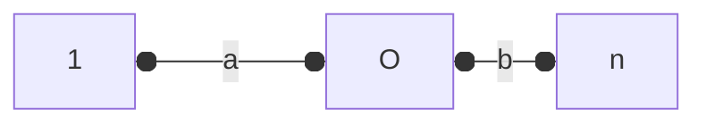

---
tags:
  - 离散数学
---
***离散数学初等介绍***

**Moral**
- **Be Sure rules are properly applied**
- **Thoughtless calculation no substitute for understanding**

**反证法**
$\mathbf{Theorem}:\sqrt{2}\ \mathbf{is} \ \mathbf{irrational}$
$\mathbf{Suppose}\ \sqrt{2}\  \mathbf{is\ rational},\mathbf{then\ we\ have}:\sqrt{2}=\frac{m}{n}$
$\mathbf{So}:2n^{2}=m^{2},\ \mathbf{if}\ m=2k,\ n^2=2k^2,\ \mathbf{we\ have\ m\ is\ even\ },\mathbf{n\ is\ even}$
## 1. $\mathbf{The well Ordering Principle}$ (良序定理)

- **Every *nonempty* set of *nonnegative* integers has a *smallest* element.**

- 每个非空的自然数集都有最小的元素
- 任意一个大于 $1$ 的自然数都可以写作若干个质数的积(<mark style="background: #D2B3FFA6;">算数基本定理</mark>)

$1+r^1+r^2+r^3+\dots+r^n=\frac{r^{n+1}-1}{r-1}$

## 2. $\mathbf{Propositional(Boolean) Logic}$ (命题和逻辑运算)

$and: \wedge \quad \ or:\vee \quad no:\neg$
**$DeMorgan's \ law$**
$$
\neg(P\vee Q)=\neg P \wedge\neg Q
$$
$SAT$ ==布尔可满足约束问题==

## 3. $\mathbf{Predicate Logic}$ (全称量词、存在量词)

- $\forall n\in \mathbb{N},\exists\  m_{0}\in\mathbb{N},m_{0}\ge n$
- $\exists n\in \mathbb{N},\forall\  m_{0}\in\mathbb{N},m_{0}\ge n$

## 4. $\mathbf{Sets:definitions}$ (集合定义)

- **有理数 $\mathbb{R}$ 、复数 $\mathbb{C}$ 、整数 $\mathbb{Z}$ 、自然数 $\mathbb{N}$ 
- **无序性、确定性、互异性**
- 集合和集合的关系、元素和集合的关系

  > $\mathbb{Z}\subseteq\mathbb{R}$、$\{0,\mathbb{N^{*}} \}=\mathbb{N}$、$1\in \mathbb{N}$

- **幂集**:一个集合所有的子集组成的集合

  > $pow(A)=all\ the\ subsets\ of\ A=\{B\ |\ B\subseteq\ A\}$
  >
  > $N(pow(A))=2^{N(A)}$

- **集合间的运算**

  > $A\ \cup\ B=\{x\ |\ x\in \ A\ or\ x\in\ B\}$ 
  >
  > $A\ \cap\ B=\{x\ |\ x\in \ A\ and\ x\in\ B\}$ 
  >
  > $A-B=\{x\ |\ x\in\ A\ and\ x\notin\ B\}$
  >
  > $A\ \cup\ (B\ \cap\ C)=(A\ \cup\ B)\ \cup\ (A\ \cup\ C)$ 

## 5. $\mathbf{Relations\ and\ Function}$

- **Binary relation**

$$\begin{align}
&A\xRightarrow{R} \ B
\\
Relations \ &contains \ A\ and \ B\ and \ R
\end{align}$$

- **Mapping Properties**
**单射、双射、满射**

单射指的是定义域内每一个点在值域中都有唯一的点与之对应；满射指值域内的每一个点都至少有一个定义域内的点与之对应；双射指的是定义域和值域内的点一一对应

单射 $N(A)\le N(B)$、满射 $N(A)\ge N(B)$、双射$N(A)=N(B)$

- <mark style="background: #D2B3FFA6;">数学归纳法</mark>:经典的多米诺骨牌
$$R(0),\forall \ n,R(n)\to R(n+1)$$
数学归纳法分为<mark style="background: #D2B3FFA6;">第一数学归纳法</mark>（普通数学归纳法）和<mark style="background: #D2B3FFA6;">第二数学归纳法</mark>（强归纳法原理）

1. 普通数学归纳法:  
(1) 当 $n=1$ 时,命题成立
(2) 假设 $n=k$ 时命题成立,则 $n=k+1$ 时命题成立,这个命题对于一切 $\mathbb{N^{+}}$ 成立

2. 强归纳法:
(1) 当 $n=1$ 时,命题成立
(2) 假设 $n<k$ 时命题成立,则 $n=k$ 时命题成立,这个命题对于一切 $\mathbb{N^{+}}$ 成立

## 6. $\mathbf{Cardinality\ Countable\ Sets}$

**定义1**:设 $X$ 是一个集合,如果 $X$ 是空集或者存在一个正整数 $n\in \mathbb{Z_{+}}$,使得集合 $X$ 和集合 $\{1,2,\dots n\}$ 之间有一个一一映射,则称集合 $X$ 是一个**有限集**,不是有限集的集合称为**无限集**；如果存在一个从集合 $X$ 到正整数集 $\mathbb{Z_{+}}$ 的单射,则称集合 $X$ 是一个**可数集**,不是可数集的集合称为**不可数集**。

**<mark style="background: #D2B3FFA6;">定理1</mark>:可数集的任何子集都是可数集**

**<mark style="background: #D2B3FFA6;">定理2</mark>:设** $X$ **和** $Y$ **是两个集合,** $f:\ X\rightarrow\ Y$ **是一个映射,如果** $X$ **是可数集,则** $f(X)$ **也是可数集**

**<mark style="background: #D2B3FFA6;">定理3</mark>:集合** $X$ **是一个可数集当且仅当存在从正整数集** $\mathbb{Z_{+}}$ **到集合** $X$ **的一个满射**

**定义2**:设 $X$ 是一个集合,如果 $X$ 是无限集且不存在存在一个正整数 $n\in \mathbb{Z_{+}}$,使得集合 $\{1,2,\dots n\}$到集合 $X$  之间有一个满射,则称集合 $X$ 是一个**不可数集**
- $Cantor's\ Theorem$ （对角线论证）
- 证明一个集合是不可数集,主要证明不存在 $\mathbb{Z_{+}}$ 到 $X$ 的满射

**集合中元素个数**:
$|A \cup B|=|A|+|B|-|A \cap B|$
$|A \cup B \cup C|=|A|+|B|+|C|-|A \cap B|-|A \cap C|-|B \cap C|+|A \cap B \cap C|$

## 7. $\mathbf{Number\ Theory}$

==**模运算**==

> 1. 取模 $a\ mod\ p$
> 2. 模 $p$ 加法 $(a+b)\ mod\ p=(a\ mod\ p+b\ mod\ p)\ mod\ p$
> 3. 模 $p$ 减法 $(a-b)\ mod\ p=(a\ mod\ p-b\ mod\ p)\ mod\ p$
> 4. 模 $p$ 乘法 $(a\times b)\ mod\ p=(a\ mod\ p\times b\ mod\ p)\ mod\ p$
> 5. 幂模 $p$ $(a^{b})\ mod\ p=((a\ mod\ p)^{b}\ mod\ p$

$Greatest \ Common \ Divisor$
$GCD(a,b)$ 记作 $a,b$的最大公约数
<mark style="background: #BBFABBA6;">定理</mark>:
$$\exists x,y\in \mathbb{Z},s.t.\ ax+by=GCD(a,b),\ ax+by>0$$

$Euler\ \phi \  function$(<mark style="background: #D2B3FFA6;">欧拉函数</mark>)
 $$\varphi(n)::=\{k\in[0,n)\ |\ GCD(k,n)=1\}$$
- 若 $p$ 是质数,则 $\varphi(p^{n})=p^{n-1}(p-1)$
- 若 $a\ |\ X$ ,则 $\varphi(aX)=a\varphi(X)$
- 若 $a,b$ 互质,则 $\varphi(a)\varphi(b)=\varphi(ab)$

## 8. $\mathbf{Directed\ Graphs}$

- $G=\{V,E\}$,$V=\{Node,Node\in V\}$,$E=\{\{v_{i},v_{j}\},\{v_{m},v_{n}\}\dots\},v_{i},v_{j}\in V$
- $Path::={V_{i}\rightarrow V_{j}}$ 

==$Directed \ Acyclic \ Graph$==（DAS）

- 从一个点出发经过一些有向边后不能返回到出发点的图称为有向无环图（$DAS$）
- 树是有向无环图的一个特例

$Simple\ Graph$

- $degrees(V)$ 表示的是节点 $V$ 一共有多少条边与另外的节点相连
- $2|E|=\sum deg(v),\ v\in V$

$Isomorphism\ Graph$

- $V$、$E$、$Degree$相同

## 9. $\mathbf{Trees}$

- ==树是边数量最少的连接图==
- $Tree::=\{V,E\}$,$N(V)=n,N(E)=n-1$
- 树是可以$2-colorable$

## 10. $\mathbf{Arithmetic\ Sums}$

- **几何级数**:$1+x+x^{2}+\dots+x^{n}=\frac{1-x^{n+1}}{1-x}$
$$
G(x)_{n}=\sum_{i=0}^{n}x^{i}
\\
\lim_{n\rightarrow +\infty}G(x)_{n}=\frac{1}{1-x},\ \ |x|<1
$$
- **调和级数**
摆书问题
一本书的长度为 $1$ , $n$ 本书最多伸出桌面的距离 $L(n)$
(1) $L(1)=\dfrac{1}{2}$
(2) 当 $n+1$ 本书伸出桌面时,上面 $n$ 本书的质心落在第 $n+1$ 本书的右边,如下图所示: $a+b=\dfrac{1}{2}$

杠杆原理: $a=bn\Rightarrow b=\dfrac{1}{2(n+1)}$
$$L(n+1)-L(n)=\frac{1}{2(n+1)}\Rightarrow L(n)=\frac{1}{2}\sum_{i=1}^{n}\frac{1}{i}$$
我们有:
$$H(n)=\sum_{i=1}^{n}\frac{1}{i};\quad L(n)=\frac{1}{2}H(n)$$
$$\int_{1}^{n+1}\frac{1}{x}dx\le\ H(n)\le\ 1+\int_{1}^{n}\frac{1}{x}dx\Rightarrow \ ln(n+1)\le H(n)\le 1+ln(n)$$

- $Stirling's \ Formula$

由公式 $(9)$ 我们可以得到:
$$
   \int_{1}^{n}ln\ x\ dx\le\sum_{i=1}^{n}ln\ i\le(\int_{1}^{n}ln\ x\ dx)+ln\ n
$$
我们可以得到: 
   $$(x\ ln\ x-x)|_{x=1}^{x=n}\le\sum_{i=1}^{n}ln\ i\le(x\ ln\ x-x)|_{x=1}^{x=n}+ln\ n$$
$$
   \sum_{i=1}^{n}ln\ i\approx n\ ln(\frac{n}{e})+\frac{ln\ n}{2}
$$
最终我们得到一个计算阶乘的公式:
$$
   n!=\sqrt{n}(\frac{n}{e})^{n}
$$

- 计数原理

  > $C_{n}^{k}=C_{n-1}^{k}+C_{n-1}^{k-1}$

- 容斥原理

  > $|A_{1} \cup A_{2} \cup \dots \cup A_{n}|=\sum\limits_{{S\subseteq\{1,2,\dots,n\}},S\ne \emptyset}(-1)^{|S|+1}\ |\cap_{i\in S}\ A_{i}|$

## 11. $\mathbf{Probability\ Theory}$

- 概率空间
- 全概公式和贝叶斯公式
- 随机变量
  - 均匀分布
  - 伯努利分布（二项分布）
  - 泊松分布
- 期望、方差
- 大数定理和中心极限定理